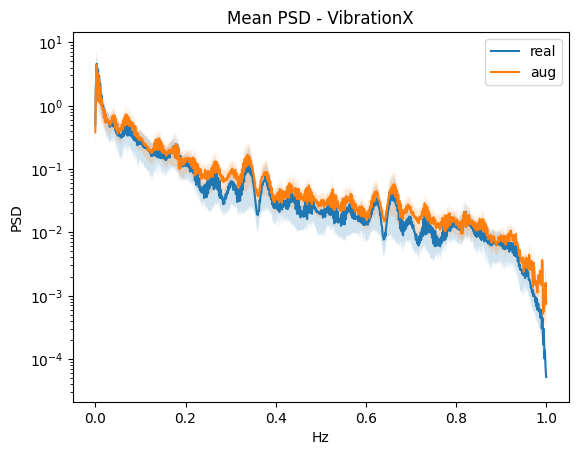
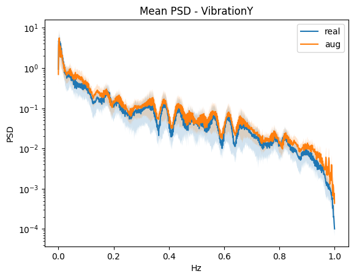
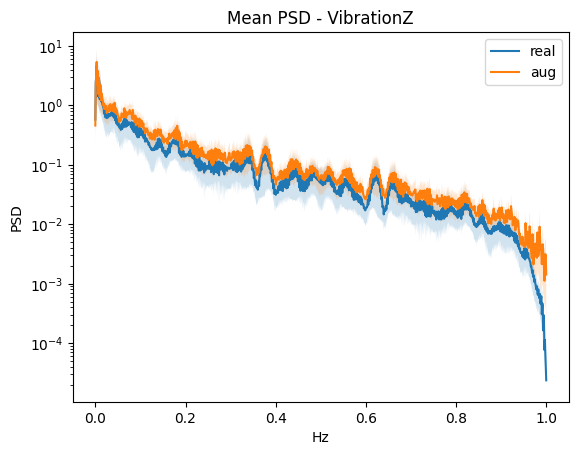
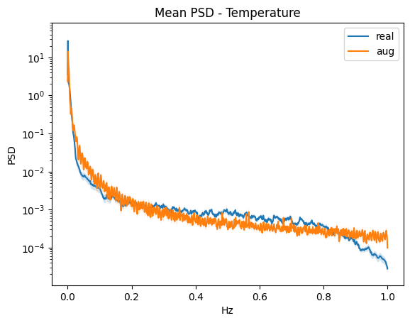
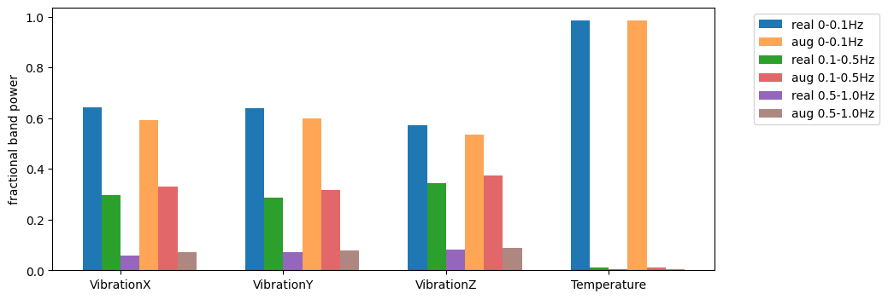
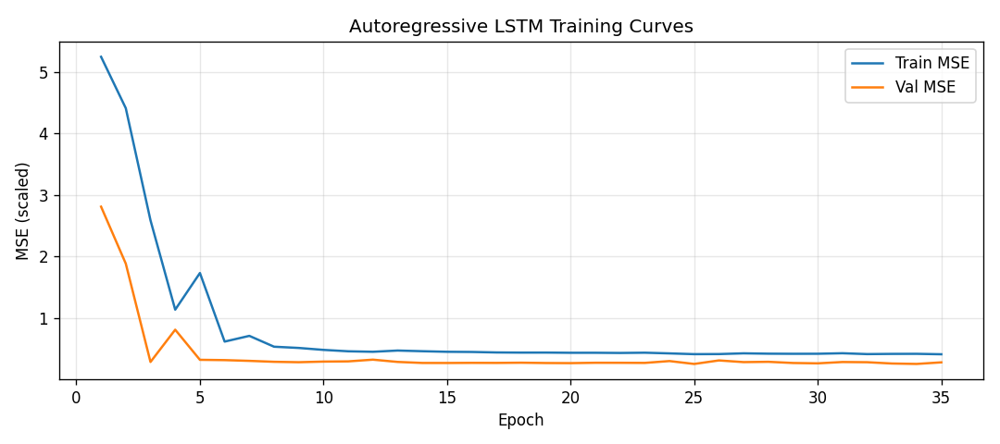
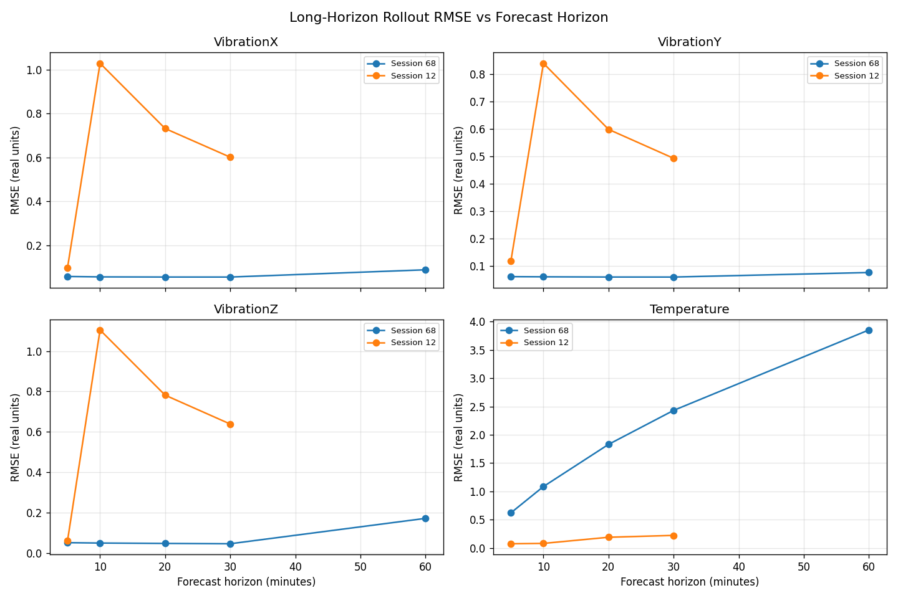

# Predictive Maintenance Digital Twin — Portfolio Demo

> **Sanitization notice:** This repository is a sanitized public portfolio version of a university capstone project originally developed for an industry-style client brief. Private client data, credentials, internal documents, and proprietary materials have been removed or replaced with synthetic/demo data.

## Project Overview

A full-stack predictive maintenance platform that monitors industrial equipment through a real-time dashboard, runs ML-based failure prediction and forecasting, and provides an agentic AI chatbot capable of querying the database, running predictions, and recommending maintenance actions.

Built as a university capstone (Swinburne COS40005) for an industry client with real manufacturing equipment.

## Why This Project Matters

Manufacturing downtime costs industry billions annually. This platform turns raw machine telemetry into actionable maintenance intelligence — moving from reactive ("fix it when it breaks") to predictive ("fix it before it breaks") maintenance.

## Key Features

- **Fleet dashboard** — real-time health scores, risk classifications, anomaly scores, and failure probability per machine
- **ML inference pipeline** — failure classification (Random Forest), LSTM time-series forecasting, and simulation serving
- **Agentic AI chatbot** — supervisor agent with 6 callable tools, RAG knowledge base, session memory, and trace logging
- **Simulation pane** — what-if scenario testing for operating conditions and maintenance actions
- **Docker Compose** — one-command local deployment of frontend, backend, and database

## Architecture

```
+----------------------------------------------------------+
|                    Next.js Frontend                       |
|   Dashboard | Chat UI | Simulation Pane | Auth            |
+------------------------------+---------------------------+
                               | REST API
+------------------------------v---------------------------+
|                  FastAPI Backend                          |
|                                                          |
|  +--------------+  +---------------+  +-------------+   |
|  | ML Inference |  | Agent System  |  | Auth/Users  |   |
|  | prediction   |  | supervisor    |  | JWT sessions|   |
|  | forecasting  |  | SQL agent     |  +-------------+   |
|  | simulation   |  | RAG / Wiki    |                    |
|  +--------------+  +---------------+                    |
+------------------------------+---------------------------+
                               |
+------------------------------v---------------------------+
|              PostgreSQL Database                          |
|  machines | telemetry | predictions | chat_history        |
|  simulations | agent_traces | users                      |
+----------------------------------------------------------+
```

## Dashboard

The client-facing dashboard provides:
- **Fleet posture view** — risk vs. health scatter plot for all machines
- **Machine status cards** — health %, risk %, uptime, failure probability, risk classification
- **Weekly event breakdown** — fault predictions, anomalies, maintenance actions by day
- **Summary metrics** — fleet size, at-risk count, average risk score, recent simulation count

## Real-Time MLOps Pipeline

Three machine types each have dedicated ML pipelines:

| Machine | Model Type | Task |
|---------|-----------|------|
| Machine A | Random Forest (scikit-learn) | Binary failure classification |
| Machine B | Random Forest + feature engineering | Multi-label failure type classification |
| Machine C | LSTM (PyTorch) + Random Forest | Time-series forecasting + failure classification |

The backend exposes inference as REST endpoints, with model input profiles and feature mapping allowing different sensor schemas to be served without code changes.

## Agentic AI Chatbot

The chatbot uses a **supervisor agent architecture** built on the OpenAI Agents SDK.

### Tool Calling

The supervisor dynamically routes user intent to one of 6 tools:

| Tool | What it does |
|------|-------------|
| `query_database` | SQL sub-agent with read-only enforcement; schema injected at startup |
| `run_prediction` | Calls ML inference pipeline for a given machine |
| `run_simulation` | Executes simulation scenarios and returns forecast results |
| `lookup_knowledge` | RAG retrieval from the LLM Wiki (Obsidian vault) |
| `propose_maintenance` | Generates structured maintenance recommendations |
| `extract_complaint` | Extracts structured fault signals from natural language |

### RAG / LLM Wiki

The agent's knowledge layer uses an **Obsidian vault** as a structured wiki rather than a flat document store. At startup, the vault is indexed and made available for semantic retrieval. This gives the agent grounded domain knowledge about machine types, maintenance procedures, and failure modes.

### Agent Tracing

Every reasoning step the agent takes is persisted to the database and surfaced in the chat UI — giving operators full transparency into how the agent reached its recommendation.

### Session Memory

The agent maintains working memory across conversation turns within a session, so follow-up questions resolve correctly without re-stating context.

## Simulation Pane

The simulation pane allows users to test what-if scenarios:
- Adjust operating parameters (temperature, load, speed)
- Apply simulated maintenance actions
- View forecast risk changes over a time horizon
- Compare baseline vs. intervention outcomes

Simulation uses the Machine C LSTM model served through the backend inference API.

## Tech Stack

**Frontend:** Next.js 14, TypeScript, Tailwind CSS, shadcn/ui, Vitest, Playwright

**Backend:** Python 3.11, FastAPI, SQLAlchemy, Pydantic, OpenAI Agents SDK, LangChain (RAG)

**ML:** scikit-learn, PyTorch, joblib, pandas, numpy

**Database:** PostgreSQL 16

**Infrastructure:** Docker, Docker Compose

**LLM:** DeepSeek (default) | OpenAI GPT-4o-mini | Ollama (local) | Google Gemini

## Demo Data

This repo uses synthetic/demo data in place of private client sensor readings:

- `ml/data/raw_data/ai4i2020.csv` — public UCI AI4I 2020 Predictive Maintenance dataset (10,000 records)
- `ml/data/raw_data/machine_failure_data.csv` — synthetic telemetry simulation dataset
- `ml/data/raw_data/sensordata_demo.csv` — synthetic Machine C sensor data generated to match original schema (VibrationX/Y/Z, Temperature, session, label)

To regenerate demo sensor data:
```bash
python ml/machine_c/scripts/generate_demo_data.py
```

ML models for Machine C were trained on proprietary sensor data from the capstone client engagement and are included as pre-trained binaries for demo inference.

## API Overview

| Method | Endpoint | Description |
|--------|----------|-------------|
| POST | `/api/v1/auth/login` | Authenticate and get JWT |
| GET | `/api/v1/machines/` | List all machines with status |
| GET | `/api/v1/machines/{id}/telemetry` | Recent telemetry for a machine |
| POST | `/api/v1/chat/` | Send message to agent |
| GET | `/api/v1/history/` | Chat history for session |
| POST | `/api/v1/simulations/` | Run a simulation scenario |
| GET | `/api/v1/simulations/{id}` | Get simulation result |

Full API docs available at `http://localhost:8000/docs` when running locally.

## How to Run Locally

### Prerequisites
- Docker and Docker Compose
- A DeepSeek API key (free tier available at platform.deepseek.com)

### Steps

```bash
# 1. Clone the repo
git clone https://github.com/NathanVuSwinburne/predictive-maintenance-digital-twin-demo
cd predictive-maintenance-digital-twin-demo

# 2. Set up environment
cp apps/backend/.env.example apps/backend/.env
# Edit apps/backend/.env and add your DEEPSEEK_API_KEY

# 3. Start all services
docker compose up --build

# 4. Open the dashboard
# Frontend: http://localhost:3000
# API docs: http://localhost:8000/docs
```

Default login credentials (seeded demo data):
- Username: `admin` / Password: `admin`

## Screenshots

### Synthetic Data Evaluation — Machine C Vibration & Temperature PSD Analysis

Power Spectral Density plots from the TSGM synthetic data generation process, used to validate that generated Machine C training data preserves real frequency-domain characteristics:







### LSTM Forecast Model Training




> Dashboard and chat UI screenshots to be added. Run locally to see the live interface.

## My Contribution (Thanh Nam Vu)

- Analysed limitations of the existing LangGraph router-based architecture and led migration to a native tool-calling architecture using the OpenAI Agents SDK
- Designed and implemented the supervisor agent with dynamic routing across 6 tools
- Built a dedicated SQL sub-agent with read-only enforcement and schema/routing documentation injected via `agent_wiki/` at startup
- Replaced the FAISS/RAG knowledge layer with an Obsidian wiki integration as the agent's second brain for domain knowledge lookups
- Added agent trace persistence so internal reasoning steps are stored in the database and surfaced in the chat UI
- Implemented session-level working memory so the agent retains context across conversation turns
- Wrote unit tests for tool imports, complaint extraction, and proposal management
- Contributed to model input profiles and sensor-feature mapping for multi-machine schema support

## Team & Contributions

| Name | Role | Key Contributions |
|------|------|-------------------|
| **Thanh Nam Vu** | ML/AI Engineer | Agentic supervisor, tool calling, RAG/wiki integration, agent tracing, session memory |
| Sy Dam Viet Nguyen | Frontend Engineer | Dashboard redesign, fleet posture scatter plot, weekly event chart, status cards |
| Nathan Wijaya | Full-Stack / DevOps | Intent parsing, mock data removal, Docker containerisation, Vitest/Playwright testing, MQTT ingestion framework |
| Alexander Rigato | IoT / Backend | gRPC/MQTT sensor framework, MQTT subscription-based assignment manager, live data integration prototype |
| Hoang Trang Anh Pham | AI / Project | Tool-calling agent contribution, agent trace support, sprint planning, synthetic data reporting |
| Andy Truong | ML Research / PM | TSGM LSTM evaluation, synthetic data quality assessment, sprint Gantt chart, team progress tracking |

## Limitations

- Live MQTT sensor integration is a prototype; the dashboard currently uses seeded demo data
- ML models for Machine C were trained on proprietary client data; retraining on public datasets is a future goal
- Per-user API rate limiting for the chatbot is not yet implemented
- Dashboard and chat UI screenshots not yet included in this README

## Future Improvements

- Live sensor ingestion via MQTT with configurable topic routing
- Per-user chatbot rate limiting (planned: 5 calls per session)
- Retrain Machine C models on fully public datasets
- Grafana/Prometheus monitoring for model drift and API latency
- CI/CD pipeline for model retraining and deployment

## Confidentiality Note

This repository is a sanitized public portfolio version of a university capstone project (Swinburne COS40005) originally developed for an industry-style client brief. Private client sensor data, credentials, internal documents, university submission files, and proprietary materials have been removed or replaced with synthetic/demo data. The original repository remains private.
