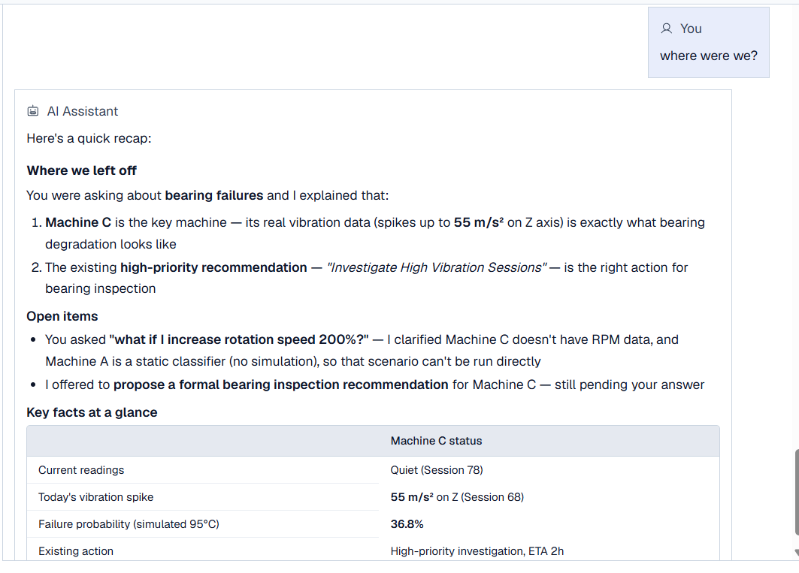
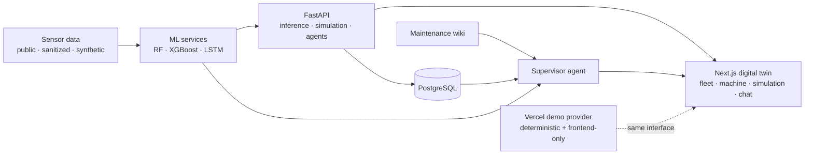

<div align="center">


# Predictive Maintenance Digital Twin

**The story of how a data problem grew into a full-stack AI engineering system.**

[](https://predictive-maintenance-digital-twin.vercel.app/dashboard)
[](apps/frontend)
[](apps/backend)
[](#chapter-4--the-dashboard-needed-a-brain)

`DATA ANALYSIS` → `DATA SCIENCE` → `DIGITAL TWIN` → `AI ENGINEERING`

[The story](#the-short-version) · [Results](#what-survived-the-experiments) · [Architecture](#under-the-hood) · [Run locally](#run-it-yourself)

</div>

---

## The short version

Industrial machines rarely fail with a polite calendar invite. They drift. Vibration changes, temperature moves, and risk quietly accumulates. Someone has to notice before downtime becomes expensive.

This capstone began with a simple question:

> **Can we turn noisy machine telemetry into a useful maintenance decision before the machine fails?**

Answering it pulled the project through three disciplines I wanted to connect in one system:

| Hat I had to wear | The actual job |
|---|---|
| **Data analyst** | Understand sensor behaviour, data quality, imbalance, gaps, and what the numbers can honestly support. |
| **Data scientist** | Build classification and time-series forecasting workflows, test synthetic augmentation, and keep weak classes visible. |
| **AI engineer** | Put models behind APIs, persist operational state, add simulations, and build an agent that can use tools and explain what it did. |

The result is not just a notebook and not just a dashboard. It is a working digital-twin demo where a user can inspect fleet health, forecast risk, test interventions, and ask an AI assistant to investigate the system with visible tool traces.

### Three data sources, three machine profiles

To make different datasets easier to understand, we treat each source as a machine:

| Machine | Data source | Role in the system |
|---|---|---|
| **Machine A** | Public AI4I dataset | Snapshot failure classification |
| **Machine B** | Public synthetic multi-sensor dataset | Telemetry and interface testing |
| **Machine C** | Private client sensor dataset | Vibration forecasting and simulation |

These names identify data profiles, not three physical machines connected to the hosted demo.

> [!IMPORTANT]
> The public Vercel experience is a **sanitized portfolio demo**. Its “live” values are deterministic demo data. Machine C uses sanitized client-derived fixtures and clearly labelled synthetic continuations. Private raw readings, backend services, databases, and API keys are not deployed.

---

## Chapter 1: First, understand the machines

Before training anything, we had to work out what each dataset could actually tell us.

- **Machine A** gave us a public classification baseline.
- **Machine B** let us test multi-sensor telemetry and interface behaviour.
- **Machine C** brought high-frequency vibration and temperature data from the client. It also brought limited and imbalanced samples.

That last point mattered. A small dataset can still produce an impressive-looking metric. It cannot automatically produce a credible model story. So we treated the coverage gap as a data problem first, not something to hide behind a neural network.

<table>
  <tr>
    <td width="55%">
      
      <br />
      <strong>The first map:</strong> connect each data source to the prediction task it could genuinely support.
    </td>
    <td width="45%">
      
      <br />
      <strong>The join test:</strong> inspect whether generated vibration continues the observed signal without pretending it is real.
    </td>
  </tr>
</table>

### The synthetic-data decision

We used time-series generative modelling (TSGM) to expand the Machine C development set. We compared real and synthetic vibration and temperature behaviour, including frequency-domain characteristics, before using augmented data for experiments.

The public repository keeps those boundaries explicit: observed fixture, synthetic continuation, and deterministic demo state are separate concepts.

---

## Chapter 2: Then make the signal predictive

Once the data story was defensible, the project moved from analysis into modelling.

The system combines classification and forecasting because maintenance needs both:

- **Classification:** how risky is the machine, and what kind of failure may be developing?
- **Forecasting:** where are the sensor readings heading next?
- **Simulation:** what changes if an operator adjusts the conditions?

<div align="center">


<strong>Two paths, one decision:</strong> state simulation on the left, failure-type prediction on the right.

</div>

The retained LSTM reads **20 minutes** of telemetry (2,400 samples at 500 ms), predicts the next **10 minutes** (1,200 samples), and builds windows on a **5-minute stride**. Six autoregressive chunks extend that view to one hour.

We also built a constrained autoresearch loop to vary architecture, optimization, regularization, and preprocessing while keeping long-horizon evaluation criteria fixed. The point was not “AI trains AI.” The point was disciplined experiment throughput without moving the goalposts.

## What survived the experiments

These are held-out results from checked-in Machine C artifacts. They are not the fictional live values displayed by the Vercel demo.

| Retained artifact | Result |
|---|---:|
| Risk classifier | **91.28% accuracy** · **0.9631 macro OvR AUC** |
| Low-risk class | F1 **0.9502** (107 samples) |
| High-risk class | F1 **0.8333** (39 samples) |
| 10-minute LSTM · Vibration X | MAE 0.0479 · RMSE 0.1262 |
| 10-minute LSTM · Vibration Y | MAE 0.1102 · RMSE 0.2335 |
| 10-minute LSTM · Vibration Z | MAE 0.0612 · RMSE 0.1301 |
| 10-minute LSTM · Temperature | MAE 0.2425 · RMSE 0.3123 |

**The honest footnote:** the medium-risk test subset has only three samples (F1 0.4000). The aggregate score is useful, but it is not evidence of uniform performance across every class.

---

## Chapter 3: A prediction is more useful when you can challenge it

A probability alone does not tell an operator what to do next. So the models became a digital twin: a place to compare current conditions with a simulated intervention.


The simulator keeps the two timelines visible:

1. Select a real or fixture-backed source window.
2. Change the operating scenario.
3. Generate a future sensor horizon.
4. Compare baseline risk with projected risk.
5. Turn the result into a maintenance recommendation.

That changed the product question from **“Will it fail?”** to **“What can we do now, and what might that change?”**

---

## Chapter 4: The dashboard needed a brain

The first chatbot used a fixed router. Every new intent made it more brittle, so we replaced it with a **supervisor agent** that can choose tools and delegate work.

The supervisor does more than answer questions. It can:

- run failure predictions and what-if simulations
- extract useful signals from operator complaints
- create maintenance proposals
- delegate database questions to a read-only SQL sub-agent
- read machine and maintenance knowledge from a Karpathy-style LLM wiki stored in an Obsidian vault
- keep working memory across conversation turns


### From a complaint to an investigation

An operator can ask, **“Why was this machine so noisy yesterday?”** The supervisor turns that informal complaint into an investigation:

1. Read the machine capabilities and maintenance guidance from the Obsidian LLM wiki.
2. Identify noise as a possible vibration signal.
3. Delegate a read-only historical telemetry query to the SQL sub-agent.
4. Pass the retrieved row or time window to the prediction tool.
5. Combine the evidence into a clear explanation and useful next action.

This lets the agent interact with each machine through the same tools used by the application, instead of generating an answer from the prompt alone.

<table>
  <tr>
    <td width="50%">
      
      <br />
      <strong>Ask in plain English.</strong> The supervisor retrieves evidence and turns it into an operational summary.
    </td>
    <td width="50%">
      
      <br />
      <strong>Return more than text.</strong> Responses can surface machine health, risk, temperature, and vibration as UI components.
    </td>
  </tr>
</table>

<table>
  <tr>
    <td width="50%">
      
      <br />
      <strong>Show the actions.</strong> The trace shows which tool the supervisor selected, what it delegated to the SQL sub-agent, and how the result reached the final response.
    </td>
    <td width="50%">
      
      <br />
      <strong>Keep the thread.</strong> Working memory lets the assistant recap prior reasoning and unresolved actions.
    </td>
  </tr>
</table>

The team observed roughly a **75% improvement in typical response time** after the redesign. That is an internal estimate, not a controlled benchmark. It matched the architectural improvement we could see: less rigid routing, fewer unnecessary hops, and tools selected at runtime.

> [!NOTE]
> The trace shows tool calls, delegations, and results at a high level. It does not expose hidden chain-of-thought. In the frontend-only demo these actions are scripted examples of the response contract. Full-stack mode connects the same workflow to FastAPI, PostgreSQL, model services, and the Obsidian knowledge vault.

---

## Chapter 5: Close the loop with live ingestion

The final step is the bridge back to the physical machines. We prototyped configurable MQTT subscriptions so telemetry sources can be mapped without hard-coding one broker or one machine.

<table>
  <tr>
    <td width="42%">
      
      <br />
      <strong>Configure the source:</strong> endpoint, port, QoS, and topic.
    </td>
    <td width="58%">
      
      <br />
      <strong>Manage the mapping:</strong> see connection state and assign topics to machine streams.
    </td>
  </tr>
</table>

This is a prototype for future ingestion, not a claim that the public Vercel demo is connected to live industrial equipment.

---

## Under the hood



The `DigitalTwinDataProvider` is the seam between deployment modes:

- `NEXT_PUBLIC_DEMO_MODE=true` → deterministic frontend-only portfolio experience
- unset or `false` → FastAPI provider with the local Docker stack

### Stack

| Layer | Technology |
|---|---|
| Frontend | Next.js 16 · React 19 · TypeScript · Tailwind CSS · Recharts |
| Backend | FastAPI · SQLAlchemy · Pydantic · PostgreSQL |
| ML | PyTorch LSTM · XGBoost · Random Forest · scikit-learn · pandas · NumPy |
| Agent system | Supervisor · six domain tools · read-only SQL sub-agent · working memory · knowledge wiki · persisted traces |
| Quality | Vitest · Playwright · linting · production build checks |

<details>
<summary><strong>What gets persisted?</strong></summary>

Machines, telemetry profiles, predictions, recommendations, history, simulations, user access, sessions, chat memory, MFA state, and agent traces are represented in the PostgreSQL/SQLAlchemy model. The source of truth is [`apps/backend/app/db/models.py`](apps/backend/app/db/models.py).

</details>

<details>
<summary><strong>What can I explore in the interface?</strong></summary>

- Fleet health, risk, uptime, weekly events, and machine telemetry
- Random Forest classification and autoregressive LSTM forecasting flows
- Baseline-versus-intervention simulations
- AI-assisted investigation with visible tool traces
- Roles, per-machine access, history, and account security
- Frontend-only demo mode or the full FastAPI/PostgreSQL stack

</details>

---

## Run it yourself

### Fastest path: frontend demo mode

```bash
cd apps/frontend
npm ci
cp .env.example .env.local
# Set NEXT_PUBLIC_DEMO_MODE=true
npm run dev
```

Open `http://localhost:3000`.

### Full stack

```bash
cp apps/backend/.env.example apps/backend/.env
docker compose up --build
```

FastAPI documentation is available at `http://localhost:8000/docs`. The seeded local account is `admin` / `admin`; the hosted Vercel demo needs no credentials.

### Verify it

```bash
cd apps/frontend
npm run test:unit
npm run lint
npm run build
npm run test:e2e
```

### Deploy the portfolio mode

Import the repository into Vercel and set the root directory to `apps/frontend`. The included `vercel.json` enables demo mode without external services or secrets.

---

## Scope, credit, and provenance

This is a sanitized portfolio repository from Swinburne University **COS40005 Computing Technology Project A/B**, built by a six-person team.

My focus was the **ML/AI engineering layer**: analysing the original routing limitations, migrating the assistant to a native tool-calling supervisor, implementing the read-only SQL sub-agent, connecting the knowledge wiki, surfacing agent traces, and adding session-level working memory.

The full team and individual contributions are documented in [CONTRIBUTORS.md](CONTRIBUTORS.md).

Private client readings, credentials, internal documents, and proprietary material are intentionally excluded. The hosted application uses ten fictional fleet instances derived from three model profiles; these are demo assets, not ten independently trained models.

<div align="center">

### Data told us what happened. Models suggested what happens next. The agent made it actionable.

[](https://predictive-maintenance-digital-twin.vercel.app/dashboard)

</div>
