# Predictive Maintenance Digital Twin

[**Open the frontend-only Vercel demo →**](https://predictive-maintenance-digital-twin.vercel.app/dashboard)

> **Portfolio demo notice:** All displayed “live” metrics are deterministic demo data. Machine A’s model foundation uses the public AI4I dataset. Machine C uses sanitized, deterministic client-derived fixtures and separately labelled synthetic continuations. Private raw client readings remain excluded; the hosted demo uses no backend, database, API key, or private data.

A university capstone that turns industrial telemetry into fleet health views, failure forecasts, what-if simulations, and traceable maintenance conversations. The hosted experience contains ten fictional fleet instances derived from three model profiles; these are demo assets, not ten independently trained models.

## What you can explore

- Fleet health, risk, uptime, weekly events, and machine-level telemetry
- Random Forest classification and an autoregressive LSTM forecasting workflow
- What-if simulations with baseline/intervention comparisons
- A supervisor-style chatbot with scripted tool calls and visible traces
- Role and machine-access administration, history, and account-security screens
- A full FastAPI/PostgreSQL mode for local development

## How the system evolved

1. **Source data.** Machine A established the classification baseline on the public AI4I 2020 predictive-maintenance dataset. Additional sensor profiles explored multi-sensor failure classification and high-frequency vibration forecasting.
2. **Coverage gap.** The available Machine C client samples were too limited and imbalanced to support a credible public training story. Raw client readings were therefore excluded from this repository and from the hosted demo.
3. **TSGM augmentation.** Time-series generative modelling expanded the Machine C development set. Frequency-domain checks compared real and synthetic vibration/temperature characteristics before augmented data was accepted for experimentation.
4. **Autoresearch tuning.** A constrained autonomous experiment loop varied the LSTM architecture, optimisation, regularisation, and preprocessing while retaining explicit long-horizon evaluation criteria.
5. **Forecasting pipeline.** The retained LSTM consumes **20 minutes** (2,400 samples at 500 ms), predicts the next **10 minutes** (1,200 samples), and creates training windows on a **5-minute stride** (600 samples). Six autoregressive 10-minute chunks roll the forecast forward to **one hour**.
6. **Operational persistence.** PostgreSQL/SQLAlchemy added machines, telemetry profiles, predictions, recommendations, history, simulations, user access, sessions, chat memory, and security state.
7. **Chatbot redesign.** A fixed router evolved into a supervisor using native tool calls for database lookup, prediction, simulation, knowledge retrieval, maintenance proposals, and complaint extraction. The team observed roughly a **75% improvement in typical response time** after this redesign; this is a team-observed estimate, not a controlled benchmark.
8. **Authentication and access.** Session authentication, optional TOTP/backup codes, roles, and per-machine user access were added for the full-stack deployment.
9. **Dashboard feedback.** Operator feedback drove the fleet posture view, summary metrics, machine cards, event breakdown, trace presentation, and clearer simulation controls.
10. **Public demo.** A deterministic provider now exercises the same frontend data contract on Vercel without deploying private data or operational services.

## Retained evaluation results

The checked-in Machine C artifacts report the following held-out results. They describe the retained experimental artifacts, not the fictional live values shown by Vercel.

| Artifact | Retained result |
|---|---:|
| Machine C risk classifier | 91.28% accuracy; 0.9631 macro one-vs-rest AUC |
| Low-risk class | F1 0.9502 (107 samples) |
| High-risk class | F1 0.8333 (39 samples) |
| 10-minute LSTM — Vibration X | MAE 0.0479; RMSE 0.1262 |
| 10-minute LSTM — Vibration Y | MAE 0.1102; RMSE 0.2335 |
| 10-minute LSTM — Vibration Z | MAE 0.0612; RMSE 0.1301 |
| 10-minute LSTM — Temperature | MAE 0.2425; RMSE 0.3123 |

The medium-risk test subset contains only three samples (F1 0.4000), so the aggregate classifier score should not be read as uniform class performance.

## Architecture

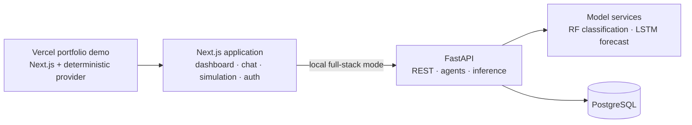

The `DigitalTwinDataProvider` interface is the seam between both deployment modes:

- `NEXT_PUBLIC_DEMO_MODE=true` → deterministic, frontend-only provider
- unset/`false` → FastAPI provider, preserving the Docker workflow

## Database model

This ER diagram mirrors every ORM table currently declared in `apps/backend/app/db/models.py`. `chat_messages.thread_id` is relationship-defining application data but is not declared as a database `ForeignKey` in the current model.

```mermaid
erDiagram
    PERSONAS {
        string id PK
        string name
        string role
        string shift
        string plant
    }
    USERS {
        string id PK
        string email
        string password
        string persona_id FK
        string access_role
        string totp_secret
    }
    USER_MACHINE_ACCESS {
        int id PK
        string user_id FK
        string machine_id FK
    }
    MACHINES {
        string id PK
        string name
        string line
        string model
        string machine_type
        string status
        float health_score
        float risk_score
    }
    MACHINE_A_TELEMETRY {
        int id PK
        string machine_id FK
        int udi
        string product_id
        float air_temp_k
        float process_temp_k
    }
    MACHINE_B_TELEMETRY {
        int id PK
        string machine_id FK
        string timestamp
        float temperature
        float vibration_level
    }
    MACHINE_C_TELEMETRY {
        int id PK
        string machine_id FK
        int session_id
        string time_collected
        string risk_label
    }
    MACHINE_C_SIMULATION_TELEMETRY {
        int id PK
        string machine_id FK
        int session_id
        string time_collected
        boolean synthetic
    }
    PREDICTIONS {
        string id PK
        string machine_id FK
        datetime generated_at
        int horizon_hours
        float probability
    }
    RECOMMENDATIONS {
        string id PK
        string machine_id FK
        string action_type
        string priority
    }
    HISTORY_EVENTS {
        string id PK
        string machine_id FK
        string user_id FK
        string timestamp
        string type
    }
    CHAT_THREADS {
        string id PK
        string machine_id FK
        string user_id FK
        string title
        string updated_at
    }
    CHAT_MESSAGES {
        string id PK
        string thread_id "relationship field"
        string role
        string created_at
    }
    MFA_TOKENS {
        string token PK
        string user_id FK
    }
    PENDING_TOTP_SETUPS {
        string token PK
        string user_id FK
        string secret
        datetime created_at
    }
    MFA_BACKUP_CODES {
        int id PK
        string user_id FK
        string code
        boolean used
    }
    SESSIONS {
        string token PK
        string user_id FK
        string active_persona_id FK
        string authenticated_at
    }
    SIMULATIONS {
        string id PK
        string machine_id FK
        string user_id FK
        string created_at
        float projected_risk
    }

    PERSONAS ||--o{ USERS : persona_id
    PERSONAS ||--o{ SESSIONS : active_persona_id
    USERS ||--o{ USER_MACHINE_ACCESS : user_id
    MACHINES ||--o{ USER_MACHINE_ACCESS : machine_id
    MACHINES ||--o{ MACHINE_A_TELEMETRY : machine_id
    MACHINES ||--o{ MACHINE_B_TELEMETRY : machine_id
    MACHINES ||--o{ MACHINE_C_TELEMETRY : machine_id
    MACHINES ||--o{ MACHINE_C_SIMULATION_TELEMETRY : machine_id
    MACHINES ||--o{ PREDICTIONS : machine_id
    MACHINES ||--o{ RECOMMENDATIONS : machine_id
    MACHINES ||--o{ HISTORY_EVENTS : machine_id
    USERS ||--o{ HISTORY_EVENTS : user_id
    MACHINES ||--o{ CHAT_THREADS : machine_id
    USERS ||--o{ CHAT_THREADS : user_id
    CHAT_THREADS ||--o{ CHAT_MESSAGES : thread_id
    USERS ||--o{ MFA_TOKENS : user_id
    USERS ||--o{ PENDING_TOTP_SETUPS : user_id
    USERS ||--o{ MFA_BACKUP_CODES : user_id
    USERS ||--o{ SESSIONS : user_id
    MACHINES ||--o{ SIMULATIONS : machine_id
    USERS ||--o{ SIMULATIONS : user_id
```

## Visual record

### Machine learning and data augmentation

| Pipeline | Synthetic-data validation |
|---|---|
| 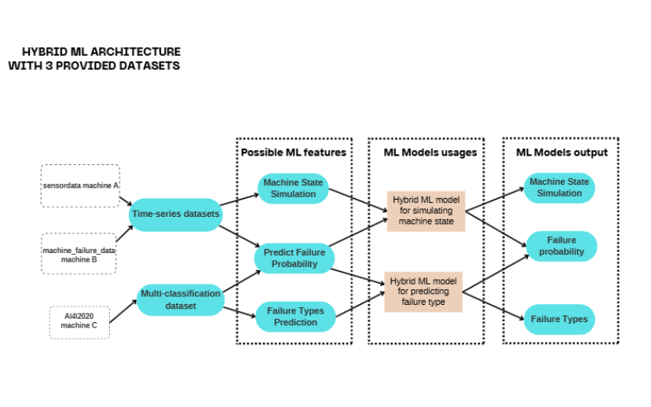 | 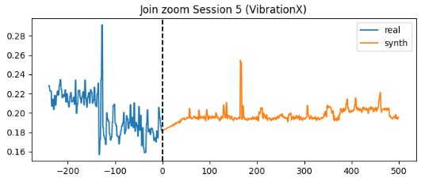 |
| 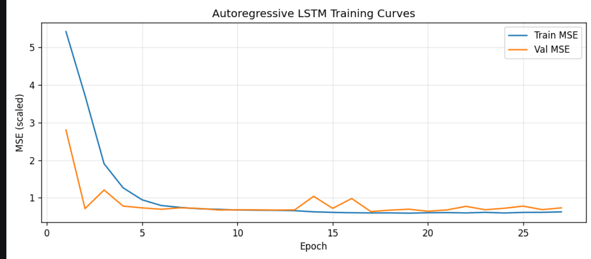 | 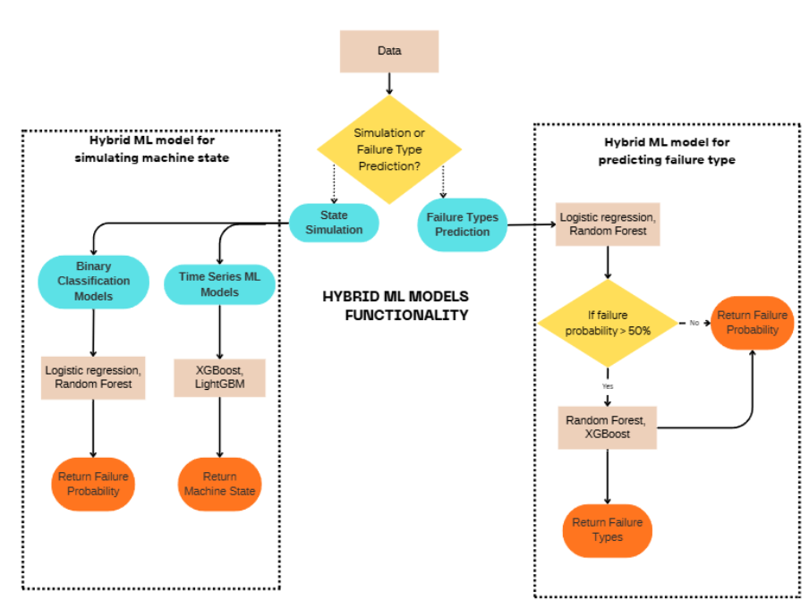 |

### Chatbot and tool tracing

| Supervisor design | Trace visibility |
|---|---|
| 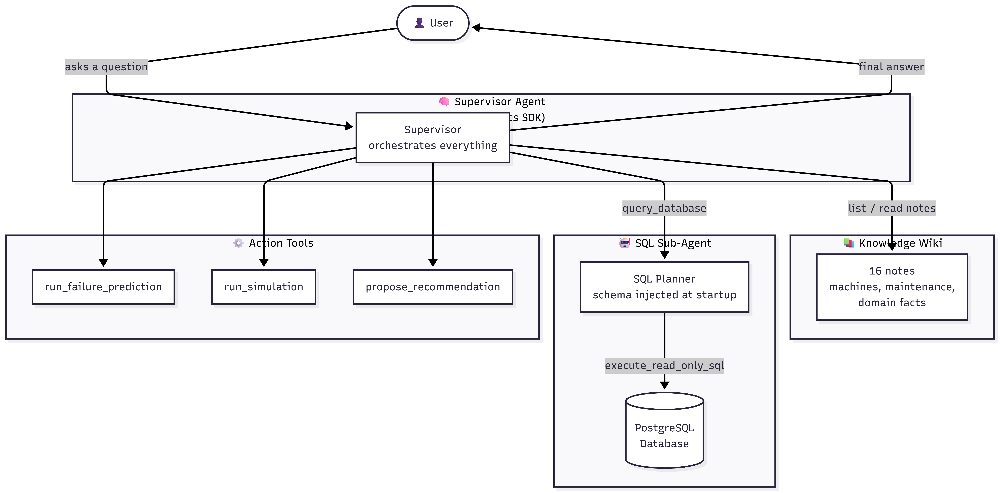 | 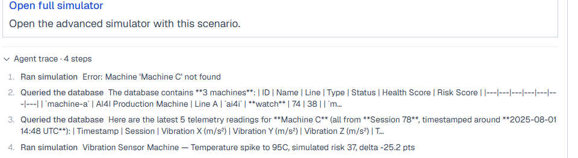 |
| 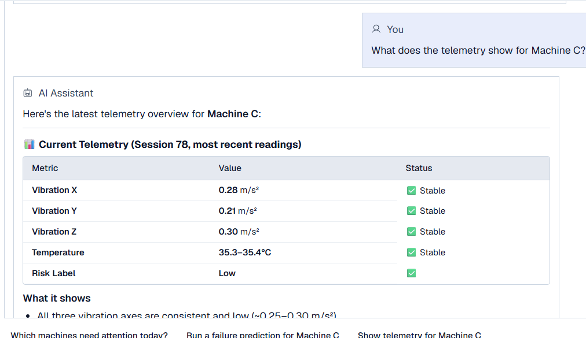 | 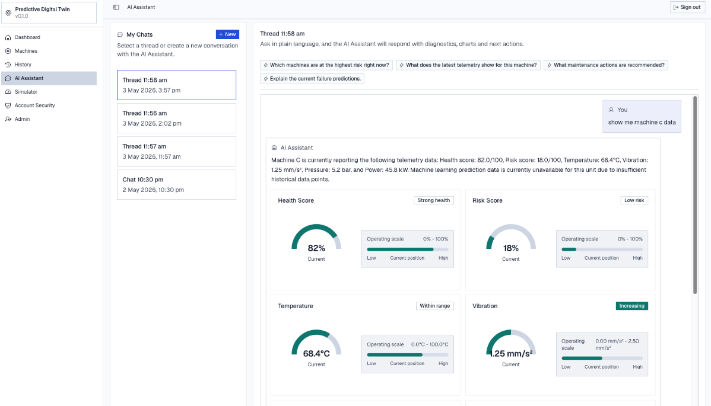 |

### Simulation

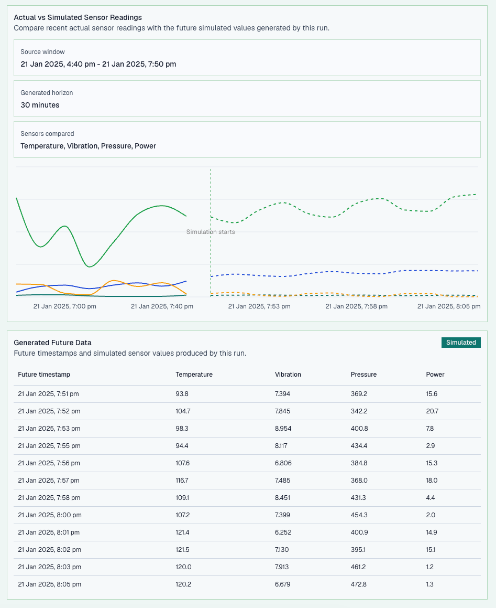

### Future MQTT ingestion

| Subscription mapping | Topic assignment prototype |
|---|---|
| 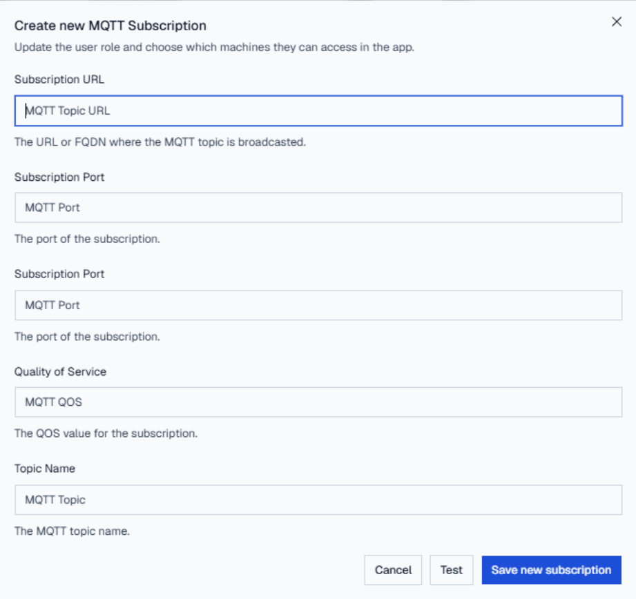 | 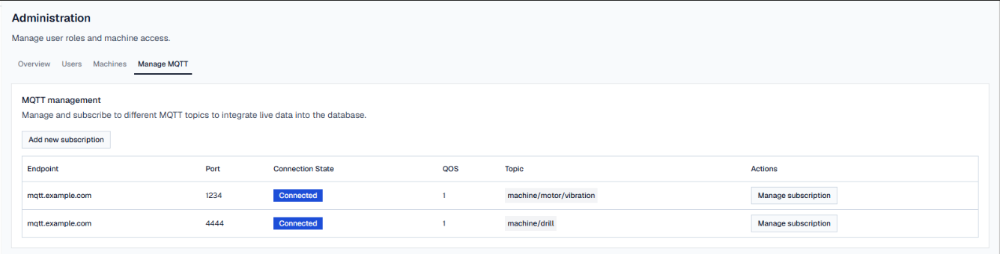 |

## Run locally

### Hosted-demo behavior only

Demo mode uses one deterministic engineering registry across Machines, History, Predict, Simulation, and the Assistant. Machine C sessions model intermittent supervisor captures lasting one to five hours, with multi-day gaps between collection visits; they are not continuous plant telemetry or fault labels. Public observed fixtures preserve sanitized session structure without publishing private raw client rows. Any future continuation is generated deterministically and labelled `Synthetic forecast`, separately from `Observed/client-derived fixture` data.

The Assistant’s tables, charts, status cards, comparisons, and visible tool traces are scripted demonstrations of response formats that a production agent may select. Demo prediction scores are bounded engineering calculations, not validated production inference. FastAPI-backed behavior is unchanged by demo mode.

```bash
cd apps/frontend
npm ci
cp .env.example .env.local
# Set NEXT_PUBLIC_DEMO_MODE=true
npm run dev
```

### Full stack

```bash
cp apps/backend/.env.example apps/backend/.env
docker compose up --build
```

Open `http://localhost:3000`. FastAPI documentation is at `http://localhost:8000/docs`. The seeded local full-stack account is `admin` / `admin`; the Vercel demo uses its **Explore live demo** button and requires no credentials.

## Deploy on Vercel

Import this repository and set **Root Directory** to `apps/frontend`. The included `vercel.json` enables `NEXT_PUBLIC_DEMO_MODE=true`; no other environment variables or services are required.

## Tests

```bash
cd apps/frontend
npm run test:unit
npm run lint
npm run build
npm run test:e2e
```

## Stack and scope

- Frontend: Next.js 16, React 19, TypeScript, Tailwind CSS, Recharts, Vitest, Playwright
- Backend: FastAPI, SQLAlchemy, Pydantic, PostgreSQL
- ML: PyTorch LSTM, XGBoost/Random Forest workflows, scikit-learn, pandas, NumPy
- Agent system: supervisor, six domain tools, working memory, RAG/wiki retrieval, persisted traces

This is a sanitized portfolio repository from Swinburne COS40005. Private client readings, credentials, internal documents, and proprietary materials are excluded. See [CONTRIBUTORS.md](CONTRIBUTORS.md) for team contributions.
