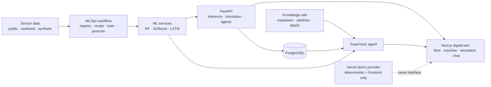

<div align="center">


# Predictive Maintenance Digital Twin

**The story of how a data problem grew into a full-stack AI engineering system.**

[](https://predictive-maintenance-digital-twin.vercel.app/dashboard)
[](apps/frontend)
[](apps/backend)
[](#the-dashboard-needed-a-brain)

`DATA ANALYSIS` → `DATA SCIENCE` → `MLOPS` → `DIGITAL TWIN` → `AI ENGINEERING`

**[Start anywhere ↓](#start-anywhere)**

[The story](#the-short-version) · [MLOps](#a-trained-model-is-not-yet-a-workflow) · [Knowledge wiki](#memory-the-agent-can-read-and-so-can-you) · [Screens](#the-demo-in-pictures) · [Architecture](#under-the-hood) · [Run locally](#run-it-yourself) · [Glossary](#plain-english-glossary)

</div>

---

## Start anywhere

This is written as a set of connected pages rather than a sequence. Each one ends with where to go next, so you can follow the story straight through or drop into the part you came for.

The later pages get technical, but each one opens with a plain summary before the detail, and there is a [glossary](#plain-english-glossary) that defines every term in a sentence. You should not need a background in machine learning to follow any of it.

| Page | What it answers |
|---|---|
| [The short version](#the-short-version) | What this is, and the three data profiles behind it |
| [First, understand the machines](#first-understand-the-machines) | What each dataset could honestly support |
| [Then make the signal predictive](#then-make-the-signal-predictive) → [what survived](#what-survived-the-experiments) | The models, and the results that held up |
| [A trained model is not yet a workflow](#a-trained-model-is-not-yet-a-workflow) | **MLOps**: getting from a trained model to a workflow anyone can rerun |
| [A prediction you can challenge](#a-prediction-is-more-useful-when-you-can-challenge-it) | The digital twin: baseline against simulated intervention |
| [The dashboard needed a brain](#the-dashboard-needed-a-brain) | The supervisor agent, its tools, and its visible traces |
| [Memory the agent can read](#memory-the-agent-can-read-and-so-can-you) | **Knowledge wiki**: why the agent's memory is readable pages and not a numeric index |
| [Close the loop](#close-the-loop-with-live-ingestion) | The MQTT ingestion prototype |
| [The demo, in pictures](#the-demo-in-pictures) | Every screen, and where it is explained |
| [Under the hood](#under-the-hood) | Architecture, stack, and what gets persisted |
| [Run it yourself](#run-it-yourself) | Demo mode in four commands, or the whole stack |
| [What this leans on](#what-this-leans-on) | The datasets, standards and the paper behind the wiki |
| [Plain-English glossary](#plain-english-glossary) | Every term used here, one sentence each |
| [Scope, credit and provenance](#scope-credit-and-provenance) | Who built what, and what is deliberately not here |

---

## The short version

Industrial machines rarely fail with a polite calendar invite. They drift. Vibration changes, temperature moves, and risk quietly accumulates. Someone has to notice before downtime becomes expensive.

This capstone began with a simple question:

> **Can we turn noisy machine telemetry into a useful maintenance decision before the machine fails?**

Answering it pulled the project through three disciplines I wanted to connect in one system:

| Hat I had to wear | The actual job |
|---|---|
| **Data analyst** | Work out how the sensors behave, how good the data is, where it is missing, and what the numbers can honestly support. |
| **Data scientist** | Build the models that score risk and the models that predict the next readings, test whether generated data helps, and keep the rare cases visible instead of averaged away. |
| **AI engineer** | Put the models behind an API, store what happens, add simulations, and build an assistant that can use real tools and show what it did. |

The result is not just a notebook and not just a dashboard. It is a working digital-twin demo where a user can inspect fleet health, forecast risk, test interventions, and ask an AI assistant to investigate the system with visible tool traces.

### Three data sources, three machine profiles

To make different datasets easier to understand, we treat each source as a machine:

| Machine | Data source | Role in the system |
|---|---|---|
| **Machine A** | Public AI4I dataset | Snapshot failure classification |
| **Machine B** | Public synthetic multi-sensor dataset | Telemetry and interface testing |
| **Machine C** | Private client sensor dataset | Vibration forecasting and simulation |

These names identify data profiles, not three physical machines connected to the hosted demo.

> [!IMPORTANT]
> The public Vercel experience is a **sanitized portfolio demo**. Its “live” values are deterministic demo data. Machine C uses sanitized client-derived fixtures and clearly labelled synthetic continuations. Private raw readings, backend services, databases, and API keys are not deployed.
>
> Two panes are an exception worth knowing about. The [MLOps workspace](#a-trained-model-is-not-yet-a-workflow) and the [knowledge wiki](#memory-the-agent-can-read-and-so-can-you) are frontend-only but not scripted: they really compute, in your browser, over public and synthetic data only.

<sub>↑ [Map](#start-anywhere) · → **Next:** [First, understand the machines](#first-understand-the-machines) · ↔ **Related:** [Run it yourself](#run-it-yourself)</sub>

---

## First, understand the machines

Before training anything, we had to work out what each dataset could actually tell us.

- **Machine A** gave us a public classification baseline.
- **Machine B** let us test multi-sensor telemetry and interface behaviour.
- **Machine C** brought high-frequency vibration and temperature data from the client. It also brought limited and imbalanced samples.

That last point mattered. A small, lopsided dataset can still produce an impressive-looking score, because the model gets good at the common case and is barely tested on the rare one. So we treated the missing coverage as a data problem to solve first, rather than something to hide behind a bigger model.

<table>
  <tr>
    <td width="55%">
      
      <br />
      <strong>The first map:</strong> connect each data source to the prediction task it could genuinely support.
    </td>
    <td width="45%">
      
      <br />
      <strong>The join test:</strong> inspect whether generated vibration continues the observed signal without pretending it is real.
    </td>
  </tr>
</table>

### The synthetic-data decision

We used a generative model (TSGM) to produce extra vibration and temperature data in the style of the real readings, because the client set was small. Before using any of it, we compared the generated signal against the real one, including how its energy is spread across frequencies, which is where a plausible-looking fake usually gives itself away.

The public repository keeps those boundaries explicit: observed fixture, synthetic continuation, and deterministic demo state are separate concepts.

<sub>↑ [Map](#start-anywhere) · → **Next:** [Then make the signal predictive](#then-make-the-signal-predictive) · ↔ **Related:** [What this leans on](#what-this-leans-on)</sub>

---

## Then make the signal predictive

Once the data story was defensible, the project moved from analysis into modelling.

The system combines classification and forecasting because maintenance needs both:

- **Classification:** how risky is the machine, and what kind of failure may be developing?
- **Forecasting:** where are the sensor readings heading next?
- **Simulation:** what changes if an operator adjusts the conditions?

<div align="center">


<strong>Two paths, one decision:</strong> state simulation on the left, failure-type prediction on the right.

</div>

An LSTM is a model built for sequences: it learns from a run of readings over time rather than a single snapshot. The one we kept reads **20 minutes** of telemetry (2,400 samples at 500 ms) and predicts the next **10 minutes** (1,200 samples), stepping forward in **5-minute** increments. Feeding its own output back in six times extends the view to a full hour.

We also built an automated search that tried model variants on our behalf, changing the architecture, the training settings and the data preparation, while the test it had to pass stayed locked. The point was not “AI trains AI.” The point was running many experiments without quietly moving the goalposts between them.

## What survived the experiments

These are held-out results from checked-in Machine C artifacts. They are not the fictional live values displayed by the Vercel demo.

| Retained artifact | Result |
|---|---:|
| Risk classifier | **91.28% accuracy** · **0.9631 macro OvR AUC** |
| Low-risk class | F1 **0.9502** (107 samples) |
| High-risk class | F1 **0.8333** (39 samples) |
| 10-minute LSTM · Vibration X | MAE 0.0479 · RMSE 0.1262 |
| 10-minute LSTM · Vibration Y | MAE 0.1102 · RMSE 0.2335 |
| 10-minute LSTM · Vibration Z | MAE 0.0612 · RMSE 0.1301 |
| 10-minute LSTM · Temperature | MAE 0.2425 · RMSE 0.3123 |

**The honest footnote:** the medium-risk test subset has only three samples (F1 0.4000), which is too few to conclude anything from. The overall score is useful, but it is not evidence that the model performs evenly across every class.

<sub>↑ [Map](#start-anywhere) · → **Next:** [A trained model is not yet a workflow](#a-trained-model-is-not-yet-a-workflow) · ↔ **Related:** [A prediction you can challenge](#a-prediction-is-more-useful-when-you-can-challenge-it)</sub>

---

## A trained model is not yet a workflow

> **In plain terms:** training a model is the easy half. The hard half is being able to do it again next month and get the same thing back. This page is about turning a one-off training script into a workflow anyone can rerun, inspect and disagree with.

The section above produced numbers. Numbers turned out to be the easy part.

Before this project I worked as an **ML engineer intern**, and what stayed with me was not the modelling. It was the gap between training a model once and having a process someone else can repeat. Three things went wrong there, and all three are ordinary:

- The data preparation lived in a notebook cell, so nobody could rerun it exactly.
- The scaler, the step that puts every sensor onto a comparable numeric range, was written once for training and written again, slightly differently, for serving. Two copies of one rule drift apart.
- The score arrived in a chat message, with no record of which rows produced it.

So in this project, preparing the data, scoring a model, approving it and serving it are **visible steps in the product** rather than things you had to be in the room for. That work has a concrete origin in this repository.

### Machine C was never generic

> **In plain terms:** the first version of this pipeline only worked for one specific machine, because facts about that machine were baked into the code. Making it work for any machine meant writing down what a machine *is*, in configuration, instead of assuming it.

The Machine C pipeline was written for exactly one machine, and it showed.

| Before | After |
|---|---|
| Column order fixed in code: position 0 was X, position 1 was Y, position 2 was Z | Columns declared by name, type and unit in a registry entry |
| How much history to read was a number typed into the training script, and typed again into the serving path | How much history to read is part of the recipe, versioned with the dataset |
| Time was assumed everywhere: windows, lags and session boundaries throughout | `timestamp` and `session_id` are **labels on a row, never model inputs**, and a machine is allowed to have neither |
| One model path, because there was only ever one machine | Each machine **declares what it can support**: detection, forecasting, or both |
| Data preparation lived in the notebook | A recipe frozen into a dataset version that cannot change, with a fingerprint of the exact rows |
| A scaler fitted twice, in two places | Statistics fitted on **Train only**, stored with the dataset, reused verbatim at inference |

What forced the rewrite was the AI4I machine, whose rows are independent snapshots with **no usable time axis at all**. Every assumption in the hand-written path depended on time, and no number of history rows can express *"there is no history here."* The choice was to copy the pipeline and edit it, or to describe what a machine **is** in a way that covers both. Copying is the fast answer and the wrong one: two copies become five, and the fifth copy is where two definitions of the same rule quietly stop matching.

It was not free, and the demo says so. Everything the old code took for granted had to be stated. Some domain knowledge moved out of code and into configuration, where you can see it but the compiler can no longer check it. The general path is slower than a hand-written one for any single machine. On a system with one machine and no plans for a second, the hand-written pipeline would have been the right answer.

What that rewrite bought is everything below.


<strong>The history is part of the machine.</strong> Each entry carries every version of its own column contract, ending at the version where it stopped needing any code written specially for it.

### Five stages you can open

The public demo ships the workflow as a frontend-only workspace at **`/mlops`**, over three public or synthetic machines. Nothing here is scripted: the recipe genuinely recomputes and the models genuinely fit, in your browser, on every click.

| Stage | What happens |
|---|---|
| **Machine** | The list of machines, and each one's **column history** as a timeline. Five versions for the drive, because a version number with no record of what changed is a number rather than a history. |
| **Data** | The columns, where they come from, and a readiness check per goal. A machine with no time axis is told plainly that it cannot forecast, rather than being offered a button that would fail. |
| **Prepare** | Train/test split, missing values, scaling, resampling, and an editor for writing **new columns as formulas** over the existing ones. Freezing the recipe produces a dataset version that can no longer change. |
| **Train** | Model types split into *runs in your browser* and *production worker only*, a settings form that refuses impossible combinations, and the exact configuration the run will record. |
| **Promote** | Every candidate scored against the trivial answer, a verdict on each, and a **written reason required** before anyone can override a blocked promotion. |


<strong>The recipe is the deliverable, not just the model.</strong> Split, missing values, scaling and calculated columns on the left; what they do to the actual rows on the right, with every statistic measured on the training rows only, so the test rows stay honest.

### The calculated-feature moment

> **In plain terms:** sometimes the useful signal is not in any one sensor, but in two of them multiplied or subtracted. Hand the model those combinations directly and it catches far more real failures.

The published AI4I failure rules are written on *combinations* of columns: power is `torque × speed`, heat dissipation is a temperature *difference*, overstrain is `wear × torque`. A model handed only the six raw columns has to rediscover each of those products for itself, from a handful of failure rows.

Spelling them out in the formula editor, with the same model, the same settings and the same split:

| | Raw columns | With `power_w`, `temp_difference_k`, `overstrain` |
|---|---:|---:|
| Balanced accuracy | 83.7% | **93.1%** |
| Recall on failures | 69.6% | **87.0%** |
| Plain accuracy | 96.3% | 98.5% |

Read those numbers against 94.3%, which is how often a row in this split is simply not a failure. A model that answered "no failure" every single time would already score 94.3% plain accuracy while catching nothing at all, which is why the middle row, how many real failures were found, matters far more than the bottom one. Those are the workspace's own default settings, so the screenshot below is a run anyone can reproduce by clicking. A unit test holds this gap in place, so the argument for having a formula editor at all cannot quietly stop being true.


<strong>Two runs, one screen:</strong> the newer run uses dataset v2 and finds 87% of the failures; the older one, same model on the raw columns, finds 69.6%. Both are scored against the same 94.3% trivial answer.

### Honesty is the feature

> **In plain terms:** a score on its own means nothing. Every number here is shown next to what you would have scored by not trying at all.

- **Every run is shown next to the trivial answer:** the score you would get by always guessing the most common outcome. An accuracy figure with nothing to compare it against is decoration.
- **The gate tells a bad model apart from a deliberate trade.** A model tuned to catch rare failures usually gives up some plain accuracy in exchange. The gate calls that `borderline` and explains it, rather than labelling it `not_recommended`.
- **A recipe that drops the informative columns really does produce a model that loses to the baseline**, and the gate really does block it. Nothing about that path is mocked.
- **Model types the browser cannot realistically train refuse to run.** LSTM, GRU, TCN and XGBoost describe themselves and then decline, explaining that they train on the production worker. Showing an invented score would have been easier and worthless.


<strong>Promotion moves a pointer, not a file.</strong> Every candidate is shown against the trivial answer with a verdict attached, and nothing is served until a person chooses one, so a caller gets an honest error rather than a silently out-of-date model.

<sub>↑ [Map](#start-anywhere) · → **Next:** [A prediction you can challenge](#a-prediction-is-more-useful-when-you-can-challenge-it) · ↔ **Related:** [Memory the agent can read](#memory-the-agent-can-read-and-so-can-you) · [Under the hood](#under-the-hood)</sub>

---

## A prediction is more useful when you can challenge it

> **In plain terms:** being told a machine is 80% likely to fail does not tell you what to do about it. So the models were wired into a digital twin, a software copy of the machine where you can try a change and see what it would do before touching the real thing.

A probability alone does not tell an operator what to do next. So the models became a digital twin: a place to put current conditions side by side with a simulated change.


The simulator keeps both futures on screen at once, the one you are heading for and the one a change would give you:

1. Select a real or fixture-backed source window.
2. Change the operating scenario.
3. Generate a future sensor horizon.
4. Compare baseline risk with projected risk.
5. Turn the result into a maintenance recommendation.

That changed the product question from **“Will it fail?”** to **“What can we do now, and what might that change?”**

<sub>↑ [Map](#start-anywhere) · → **Next:** [The dashboard needed a brain](#the-dashboard-needed-a-brain) · ↔ **Related:** [Then make the signal predictive](#then-make-the-signal-predictive)</sub>

---

## The dashboard needed a brain

> **In plain terms:** the first assistant was a long list of if-this-then-that rules, which broke a little more with every question we added. It was replaced by an agent that picks its own tools for each request and shows you which ones it used.

The first chatbot used a fixed router. Every new kind of question made it more brittle, so we replaced it with a **supervisor agent**: an assistant that chooses tools at runtime and hands specialist work to sub-agents.

The supervisor does more than answer questions. It can:

- run failure predictions and what-if simulations
- extract useful signals from operator complaints
- create maintenance proposals
- delegate database questions to a read-only SQL sub-agent
- read machine and maintenance knowledge from a Karpathy-style LLM wiki stored in an Obsidian vault
- keep working memory across conversation turns


### From a complaint to an investigation

An operator can ask, **“Why was this machine so noisy yesterday?”** The supervisor turns that informal complaint into an investigation:

1. Read the machine capabilities and maintenance guidance from the Obsidian LLM wiki.
2. Identify noise as a possible vibration signal.
3. Delegate a read-only historical telemetry query to the SQL sub-agent.
4. Pass the retrieved row or time window to the prediction tool.
5. Combine the evidence into a clear explanation and useful next action.

The agent reaches each machine through the same tools the application itself uses, so its answer comes from real retrieved evidence rather than from the wording of the question alone.

<table>
  <tr>
    <td width="50%">
      
      <br />
      <strong>Ask in plain English.</strong> The supervisor retrieves evidence and turns it into an operational summary.
    </td>
    <td width="50%">
      
      <br />
      <strong>Return more than text.</strong> Responses can surface machine health, risk, temperature, and vibration as UI components.
    </td>
  </tr>
</table>

<table>
  <tr>
    <td width="50%">
      
      <br />
      <strong>Show the actions.</strong> The trace shows which tool the supervisor selected, what it delegated to the SQL sub-agent, and how the result reached the final response.
    </td>
    <td width="50%">
      
      <br />
      <strong>Keep the thread.</strong> Working memory lets the assistant recap prior reasoning and unresolved actions.
    </td>
  </tr>
</table>

The team observed roughly a **75% improvement in typical response time** after the redesign. That is an internal estimate, not a controlled benchmark. It matched what we could see in the design: less rigid routing, fewer wasted steps, and tools chosen at the moment they were needed.

> [!NOTE]
> The trace shows which tools ran, what was handed to a sub-agent, and what came back. It does not expose the model's private reasoning. In the frontend-only demo these traces are scripted examples of the real response format. Running the full stack connects the same workflow to FastAPI, PostgreSQL, the model services, and the Obsidian knowledge vault.

<sub>↑ [Map](#start-anywhere) · → **Next:** [Memory the agent can read](#memory-the-agent-can-read-and-so-can-you) · ↔ **Related:** [Under the hood](#under-the-hood)</sub>

---

## Memory the agent can read, and so can you

> **In plain terms:** most AI systems store their reference material as unreadable numbers and fetch passages that *sound* like the question. Here it is ordinary markdown pages that link to each other, so the agent can follow a trail from one page to the next, and so a person can read, check and correct the very same pages.

The [supervisor](#the-dashboard-needed-a-brain) already reads from a maintenance wiki. This page is about why that knowledge is a **wiki** and not the usual numeric search index.

The design was inspired by **["Retrieval as Reasoning: Self-Evolving Agent-Native Retrieval via LLM-Wiki"](https://arxiv.org/abs/2605.25480)**, which argues for knowledge an agent *walks through* rather than only searches, and reports promising results on questions whose answer is spread across several documents. The paper inspired the design here; this project has not reproduced its benchmarks and does not claim its results.

The idea in one breath: **fast keyword search (BM25) to find the first page, a lasting interlinked wiki to hold the knowledge, links the agent can follow when one lookup is not enough, and pages that stay readable and editable by people instead of sitting in a store nobody can inspect.**

The standard approach, chopping documents into chunks and converting each one into a list of numbers, is very good at *"find me a passage that sounds like this"* and weak at *"what caused this, what detected it, and what did we decide last time?"*, where the answer is spread across four pages and lives in the links between them. So the corpus here is plain markdown with `[[wikilinks]]`, and a few decisions follow from that:

- **Nothing is stored as a graph.** Each page is a dot, each link written inside a page is a line, so both the graph and the search index are worked out from the text every time it is read. Edit a page and the graph changes shape in the same frame, because the text *is* the graph.
- **Links say what kind of link they are:** `sources`, `caused_by`, `detected_by`, `mitigated_by`. Invent a new kind at the top of any page and the graph draws it, with no code change anywhere.
- **A link to a page nobody has written yet becomes a *wanted page*:** drawn hollow and dashed in the graph rather than silently dropped. That is the to-do list, not an error.
- **Numbers need a source.** A figure in a `domain/` or `concepts/` page either links to the document it came from or gets flagged as unsourced, and a checking panel counts how many are still outstanding.
- **Disagreements are kept, not resolved.** Where a checked-in original contradicts the standards, a `Conflict` callout says so and both stay. The seeded vault carries seven.
- **Where each number came from is a view of its own**, and the original documents in `raw/` can never be edited, so the claim that an old in-house guideline's vibration limits are four times too permissive can be *checked* rather than taken on trust.


<strong>50 pages, 409 links.</strong> Colour is the section of the vault, a dot grows with how many other pages point at it, and every count in the header is worked out from the markdown rather than stored next to it.

<table>
  <tr>
    <td width="50%">
      
      <br />
      <strong>Search, then follow the links.</strong> Keyword search ranks the matches, the graph dims everything that did not match, and the page itself cites its sources as links you can walk.
    </td>
    <td width="50%">
      
      <br />
      <strong>Where the numbers come from.</strong> One page per outside document, marked primary, secondary, paywalled or internal, with a count of how many pages depend on it.
    </td>
  </tr>
</table>

Because the assistant writes through this same pane, two rules are enforced in the store rather than in the interface: the original documents in `raw/` cannot be edited at all, and `agent/`, which holds the assistant's own operating instructions, cannot be edited from the pane the assistant writes through. Every save needs a written reason, and each reason is appended to a log that is never rewritten, because that note is all a future reader will have to explain why a page changed.

The demo's vault at **`/knowledge`** carries 50 interlinked pages: ISO vibration severity zones, how bearings degrade, envelope analysis, what to do when failures are rare, where each public dataset came from, and the fleet's own registry entries. All of it is public-domain knowledge plus this project's own decisions. The client machine has no page here, and a test enforces that no page mentions it or any of its sensors.

<sub>↑ [Map](#start-anywhere) · → **Next:** [Close the loop](#close-the-loop-with-live-ingestion) · ↔ **Related:** [What this leans on](#what-this-leans-on) · [A trained model is not yet a workflow](#a-trained-model-is-not-yet-a-workflow)</sub>

---

## Close the loop with live ingestion

The final step is the bridge back to the physical machines. We prototyped configurable MQTT subscriptions so telemetry sources can be mapped without hard-coding one broker or one machine.

<table>
  <tr>
    <td width="42%">
      
      <br />
      <strong>Configure the source:</strong> endpoint, port, QoS, and topic.
    </td>
    <td width="58%">
      
      <br />
      <strong>Manage the mapping:</strong> see connection state and assign topics to machine streams.
    </td>
  </tr>
</table>

This is a prototype for future data ingestion. The public Vercel demo is not connected to live industrial equipment, and nothing here claims otherwise.

<sub>↑ [Map](#start-anywhere) · → **Next:** [The demo, in pictures](#the-demo-in-pictures) · ↔ **Related:** [Under the hood](#under-the-hood)</sub>

---

## The demo, in pictures

Every screen here appears somewhere above. This is the index if you would rather jump straight to one.

| Screen | Explained in |
|---|---|
| [Machine registry and schema history](assets/mlops_machine_registry.png) | [Machine C was never generic](#machine-c-was-never-generic) |
| [Preprocessing recipe with calculated features](assets/mlops_prepare_recipe.png) | [Five stages you can open](#five-stages-you-can-open) |
| [Two runs on one scorecard](assets/mlops_model_scorecard.png) | [The calculated-feature moment](#the-calculated-feature-moment) |
| [The promotion gate](assets/mlops_promotion_gate.png) | [Honesty is the feature](#honesty-is-the-feature) |
| [The knowledge graph](assets/knowledge_wiki_graph.png) | [Memory the agent can read](#memory-the-agent-can-read-and-so-can-you) |
| [A searched-and-opened wiki page](assets/knowledge_wiki_page.png) | [Memory the agent can read](#memory-the-agent-can-read-and-so-can-you) |
| [The provenance panel](assets/knowledge_wiki_provenance.png) | [Memory the agent can read](#memory-the-agent-can-read-and-so-can-you) |
| [Digital-twin simulation](assets/similation_pane_with_mockdata.png) | [A prediction you can challenge](#a-prediction-is-more-useful-when-you-can-challenge-it) |
| [Agent traces and telemetry retrieval](assets/chatbot_tracing.png) | [From a complaint to an investigation](#from-a-complaint-to-an-investigation) |
| [MQTT subscription prototype](assets/MQTT_subscription_2.png) | [Close the loop](#close-the-loop-with-live-ingestion) |

---

## Under the hood


```mermaid
flowchart LR
    Sensors["Sensor data<br/>public · sanitized · synthetic"] --> MLOps["MLOps workflow<br/>registry · recipe · train · promote"]
    MLOps --> Models["ML services<br/>RF · XGBoost · LSTM"]
    Models --> API["FastAPI<br/>inference · simulation · agents"]
    API --> DB[(PostgreSQL)]
    API --> UI["Next.js digital twin<br/>fleet · machine · simulation · chat"]
    Wiki["Knowledge wiki<br/>markdown · wikilinks · BM25"] --> Agent["Supervisor agent"]
    DB --> Agent
    Models --> Agent
    Agent --> UI
    Demo["Vercel demo provider<br/>deterministic + frontend-only"] -. same interface .-> UI
```

A single interface, `DigitalTwinDataProvider`, decides where the app's data comes from. Everything above it stays identical in both modes:

- `NEXT_PUBLIC_DEMO_MODE=true` → deterministic frontend-only portfolio experience
- unset or `false` → FastAPI provider with the local Docker stack

### Stack

| Layer | Technology |
|---|---|
| Frontend | Next.js 16 · React 19 · TypeScript · Tailwind CSS · Recharts |
| Backend | FastAPI · SQLAlchemy · Pydantic · PostgreSQL |
| ML | PyTorch LSTM · XGBoost · Random Forest · scikit-learn · pandas · NumPy |
| Agent system | Supervisor · six domain tools · read-only SQL sub-agent · working memory · knowledge wiki · persisted traces |
| MLOps workspace | Registry schema versions · frozen recipes with content digests · in-browser logistic regression, CART forest, gradient boosting, MLP and ridge-lag forecaster · quality gates |
| Knowledge wiki | Markdown + YAML frontmatter corpus · `[[wikilinks]]` · BM25 retrieval · d3-force graph · lint and provenance |
| Quality | Vitest · Playwright · linting · production build checks |

<details>
<summary><strong>What gets persisted?</strong></summary>

Machines, telemetry profiles, predictions, recommendations, history, simulations, user access, sessions, chat memory, MFA state, and agent traces are represented in the PostgreSQL/SQLAlchemy model. The source of truth is [`apps/backend/app/db/models.py`](apps/backend/app/db/models.py).

</details>

<details>
<summary><strong>What can I explore in the interface?</strong></summary>

- Fleet health, risk, uptime, weekly events, and machine telemetry
- Random Forest classification and autoregressive LSTM forecasting flows
- Baseline-versus-intervention simulations
- A five-stage MLOps workspace that really prepares data and really trains models in the browser
- An agent knowledge wiki: graph, BM25 search, editable pages, backlinks, provenance and lint
- AI-assisted investigation with visible tool traces
- Roles, per-machine access, history, and account security
- Frontend-only demo mode or the full FastAPI/PostgreSQL stack

</details>

<sub>↑ [Map](#start-anywhere) · → **Next:** [Run it yourself](#run-it-yourself) · ↔ **Related:** [The demo, in pictures](#the-demo-in-pictures)</sub>

---

## Run it yourself

### Fastest path: frontend demo mode

```bash
cd apps/frontend
npm ci
cp .env.example .env.local
# Set NEXT_PUBLIC_DEMO_MODE=true
npm run dev
```

Open `http://localhost:3000`.

### Full stack

```bash
cp apps/backend/.env.example apps/backend/.env
docker compose up --build
```

FastAPI documentation is available at `http://localhost:8000/docs`. The seeded local account is `admin` / `admin`; the hosted Vercel demo needs no credentials.

### Verify it

```bash
cd apps/frontend
npm run test:unit
npm run lint
npm run build
npm run test:e2e
```

### Deploy the portfolio mode

Import the repository into Vercel and set the root directory to `apps/frontend`. The included `vercel.json` enables demo mode without external services or secrets.

<sub>↑ [Map](#start-anywhere) · → **Next:** [What this leans on](#what-this-leans-on) · ↔ **Related:** [Memory the agent can read](#memory-the-agent-can-read-and-so-can-you)</sub>

---

## What this leans on

Very little here was invented from nothing, and the parts that came from somewhere say so, both in the wiki's sources panel and in the table below.

| Source | What it gave the project |
|---|---|
| [AI4I 2020 Predictive Maintenance Dataset](https://archive.ics.uci.edu/dataset/601/ai4i+2020+predictive+maintenance+dataset) | The public classification baseline, and the five published failure rules the [MLOps demo](#a-trained-model-is-not-yet-a-workflow) regenerates its rows from |
| ISO 10816-3 / 20816-3 and ISO 13374-1 | Vibration severity zones and the condition-monitoring block model the wiki's `domain/` pages are written against |
| Bearing fault literature (envelope analysis, the P-F curve) | The physics the assistant reasons with, cited page by page rather than in bulk |
| Time-series generative modelling (TSGM) | The [synthetic continuation](#the-synthetic-data-decision) used to expand the Machine C development set |
| ["Retrieval as Reasoning: Self-Evolving Agent-Native Retrieval via LLM-Wiki"](https://arxiv.org/abs/2605.25480) | Inspired the design of the [knowledge wiki](#memory-the-agent-can-read-and-so-can-you): retrieval an agent navigates rather than only queries. The paper reports promising multi-hop and cross-document gains; this project has not reproduced them and does not claim them. |
| Working as an ML engineer intern | The reason there is a frozen recipe and a [promotion gate](#honesty-is-the-feature) at all, rather than a notebook and a number |

<sub>↑ [Map](#start-anywhere) · → **Next:** [Plain-English glossary](#plain-english-glossary) · ↔ **Related:** [Memory the agent can read](#memory-the-agent-can-read-and-so-can-you)</sub>

---

## Plain-English glossary

Every term this README uses, in one sentence. Nothing here assumes you have trained a model before.

**The machines and their data**

| Term | What it means |
|---|---|
| **Telemetry** | The stream of readings a machine's sensors produce: vibration, temperature, torque, rotation speed. |
| **Digital twin** | A software copy of a real machine, kept close enough to the original that you can try a change on the copy first. |
| **Synthetic data** | Generated readings that continue the pattern of real ones, used to enlarge a dataset that is too small. Always labelled as generated here. |
| **MQTT** | The lightweight messaging protocol industrial sensors normally use to publish their readings. |

**Models and their scores**

| Term | What it means |
|---|---|
| **Training a model** | Showing a program many past examples so that it can judge new ones. What comes out is the model. |
| **Classification** | Sorting a single snapshot into a category: low, medium or high risk, or a type of failure. |
| **Forecasting** | Predicting where the readings themselves are heading over the next minutes. |
| **Feature** | One input column the model reads. A *calculated* feature is one you work out from others, such as torque × speed. |
| **Random Forest, XGBoost** | Two common model types that reach a decision by combining many small decision trees. |
| **LSTM** | A model built for sequences: it learns from a run of readings over time rather than one snapshot. |
| **Accuracy vs. recall** | Accuracy is how often the model is right overall. Recall on failures is how many of the real failures it actually caught. When failures are rare, recall is the honest number. |
| **The trivial answer (baseline)** | The score you would get by always guessing the most common outcome. A model has to beat it to be worth anything. |

**Getting a model into a product**

| Term | What it means |
|---|---|
| **MLOps** | The practice of making the whole model lifecycle repeatable: prepare, train, evaluate, approve, serve. |
| **Schema** | The description of a machine's columns: their names, units, types and meanings. |
| **Recipe / dataset version** | The written-down preparation steps, frozen together with a fingerprint of the exact rows they produced, so the same run can be reproduced later. |
| **Scaler** | The step that puts columns measured in different units onto a comparable numeric range. |
| **Promotion gate** | The checkpoint where a trained candidate is compared with the baseline and then either approved to serve traffic or blocked. |

**The AI assistant and its memory**

| Term | What it means |
|---|---|
| **Agent** | A language model that can take actions, not just produce text. |
| **Tool call** | One of those actions: run a query, run a prediction, read a page. Each one is shown in the trace. |
| **Supervisor agent** | The agent that decides which tool or sub-agent should handle a request, replacing a fixed set of rules. |
| **Embeddings / vector index** | The usual way to give an AI reference material: text is turned into lists of numbers, and passages that *sound* like the question are pulled back. Effective, but not readable by a person. |
| **BM25** | Classic keyword search ranking, the kind used before embeddings. Fast, exact and inspectable. |
| **Wikilink** | A `[[page name]]` written inside a page. Here, these links are the connections in the knowledge graph. |
| **Provenance** | The record of where a number or claim came from, and which pages rely on it. |

<sub>↑ [Map](#start-anywhere) · → **Next:** [Scope, credit and provenance](#scope-credit-and-provenance)</sub>

---

## Scope, credit, and provenance

This is a sanitized portfolio repository from Swinburne University **COS40005 Computing Technology Project A/B**, built by a six-person team.

My focus was the **ML/AI engineering layer**: analysing the original routing limitations, migrating the assistant to a native tool-calling supervisor, implementing the read-only SQL sub-agent, building the knowledge wiki and connecting it to the agent, surfacing agent traces, adding session-level working memory, and moving the bespoke Machine C pipeline onto a generic machine schema with a visible preparation, training and promotion workflow.

The full team and individual contributions are documented in [CONTRIBUTORS.md](CONTRIBUTORS.md).

<sub>↑ [Back to the map](#start-anywhere)</sub>

Private client readings, credentials, internal documents, and proprietary material are intentionally excluded. The hosted application uses ten fictional fleet instances derived from three model profiles; these are demo assets, not ten independently trained models.

<div align="center">

### Data told us what happened. Models suggested what happens next. The agent made it actionable.

[](https://predictive-maintenance-digital-twin.vercel.app/dashboard)

</div>
