<div align="center">


# Predictive Maintenance Digital Twin

**The story of how a data problem grew into a full-stack AI engineering system.**

[](https://predictive-maintenance-digital-twin.vercel.app/dashboard)
[](apps/frontend)
[](apps/backend)
[](#the-dashboard-needed-a-brain)

`DATA ANALYSIS` → `DATA SCIENCE` → `MLOPS` → `DIGITAL TWIN` → `AI ENGINEERING`

**[Start anywhere ↓](#start-anywhere)**

[The story](#the-short-version) · [MLOps](#a-trained-model-is-not-yet-a-workflow) · [Knowledge wiki](#memory-the-agent-can-read-and-so-can-you) · [Screens](#the-demo-in-pictures) · [Architecture](#under-the-hood) · [Run locally](#run-it-yourself)

</div>

---

## Start anywhere

This is written as a set of connected pages rather than a sequence. Each one ends with where to go next, so you can follow the story straight through or drop into the part you came for.

| Page | What it answers |
|---|---|
| [The short version](#the-short-version) | What this is, and the three data profiles behind it |
| [First, understand the machines](#first-understand-the-machines) | What each dataset could honestly support |
| [Then make the signal predictive](#then-make-the-signal-predictive) → [what survived](#what-survived-the-experiments) | The models, and the results that held up |
| [A trained model is not yet a workflow](#a-trained-model-is-not-yet-a-workflow) | **MLOps** — a machine's schema, a frozen recipe, an honest metric, a promotion gate |
| [A prediction you can challenge](#a-prediction-is-more-useful-when-you-can-challenge-it) | The digital twin: baseline against simulated intervention |
| [The dashboard needed a brain](#the-dashboard-needed-a-brain) | The supervisor agent, its tools, and its visible traces |
| [Memory the agent can read](#memory-the-agent-can-read-and-so-can-you) | **Knowledge wiki** — why the agent's memory is a wiki and not a vector index |
| [Close the loop](#close-the-loop-with-live-ingestion) | The MQTT ingestion prototype |
| [The demo, in pictures](#the-demo-in-pictures) | Every screen, and where it is explained |
| [Under the hood](#under-the-hood) | Architecture, stack, and what gets persisted |
| [Run it yourself](#run-it-yourself) | Demo mode in four commands, or the whole stack |
| [What this leans on](#what-this-leans-on) | The datasets, standards and the paper behind the wiki |
| [Scope, credit and provenance](#scope-credit-and-provenance) | Who built what, and what is deliberately not here |

---

## The short version

Industrial machines rarely fail with a polite calendar invite. They drift. Vibration changes, temperature moves, and risk quietly accumulates. Someone has to notice before downtime becomes expensive.

This capstone began with a simple question:

> **Can we turn noisy machine telemetry into a useful maintenance decision before the machine fails?**

Answering it pulled the project through three disciplines I wanted to connect in one system:

| Hat I had to wear | The actual job |
|---|---|
| **Data analyst** | Understand sensor behaviour, data quality, imbalance, gaps, and what the numbers can honestly support. |
| **Data scientist** | Build classification and time-series forecasting workflows, test synthetic augmentation, and keep weak classes visible. |
| **AI engineer** | Put models behind APIs, persist operational state, add simulations, and build an agent that can use tools and explain what it did. |

The result is not just a notebook and not just a dashboard. It is a working digital-twin demo where a user can inspect fleet health, forecast risk, test interventions, and ask an AI assistant to investigate the system with visible tool traces.

### Three data sources, three machine profiles

To make different datasets easier to understand, we treat each source as a machine:

| Machine | Data source | Role in the system |
|---|---|---|
| **Machine A** | Public AI4I dataset | Snapshot failure classification |
| **Machine B** | Public synthetic multi-sensor dataset | Telemetry and interface testing |
| **Machine C** | Private client sensor dataset | Vibration forecasting and simulation |

These names identify data profiles, not three physical machines connected to the hosted demo.

> [!IMPORTANT]
> The public Vercel experience is a **sanitized portfolio demo**. Its “live” values are deterministic demo data. Machine C uses sanitized client-derived fixtures and clearly labelled synthetic continuations. Private raw readings, backend services, databases, and API keys are not deployed.
>
> Two panes are an exception worth knowing about. The [MLOps workspace](#a-trained-model-is-not-yet-a-workflow) and the [knowledge wiki](#memory-the-agent-can-read-and-so-can-you) are frontend-only but not scripted: they really compute, in your browser, over public and synthetic data only.

<sub>↑ [Map](#start-anywhere) · → **Next:** [First, understand the machines](#first-understand-the-machines) · ↔ **Related:** [Run it yourself](#run-it-yourself)</sub>

---

## First, understand the machines

Before training anything, we had to work out what each dataset could actually tell us.

- **Machine A** gave us a public classification baseline.
- **Machine B** let us test multi-sensor telemetry and interface behaviour.
- **Machine C** brought high-frequency vibration and temperature data from the client. It also brought limited and imbalanced samples.

That last point mattered. A small dataset can still produce an impressive-looking metric. It cannot automatically produce a credible model story. So we treated the coverage gap as a data problem first, not something to hide behind a neural network.

<table>
  <tr>
    <td width="55%">
      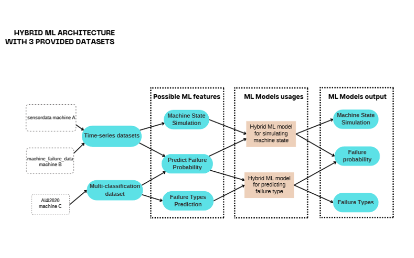
      <br />
      <strong>The first map:</strong> connect each data source to the prediction task it could genuinely support.
    </td>
    <td width="45%">
      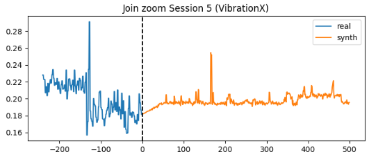
      <br />
      <strong>The join test:</strong> inspect whether generated vibration continues the observed signal without pretending it is real.
    </td>
  </tr>
</table>

### The synthetic-data decision

We used time-series generative modelling (TSGM) to expand the Machine C development set. We compared real and synthetic vibration and temperature behaviour, including frequency-domain characteristics, before using augmented data for experiments.

The public repository keeps those boundaries explicit: observed fixture, synthetic continuation, and deterministic demo state are separate concepts.

<sub>↑ [Map](#start-anywhere) · → **Next:** [Then make the signal predictive](#then-make-the-signal-predictive) · ↔ **Related:** [What this leans on](#what-this-leans-on)</sub>

---

## Then make the signal predictive

Once the data story was defensible, the project moved from analysis into modelling.

The system combines classification and forecasting because maintenance needs both:

- **Classification:** how risky is the machine, and what kind of failure may be developing?
- **Forecasting:** where are the sensor readings heading next?
- **Simulation:** what changes if an operator adjusts the conditions?

<div align="center">

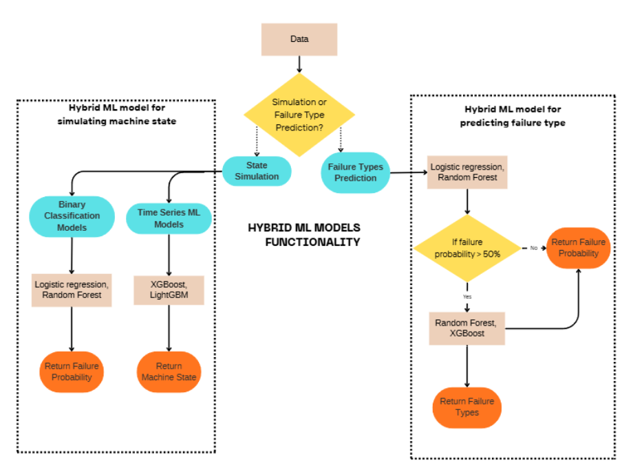

<strong>Two paths, one decision:</strong> state simulation on the left, failure-type prediction on the right.

</div>

The retained LSTM reads **20 minutes** of telemetry (2,400 samples at 500 ms), predicts the next **10 minutes** (1,200 samples), and builds windows on a **5-minute stride**. Six autoregressive chunks extend that view to one hour.

We also built a constrained autoresearch loop to vary architecture, optimization, regularization, and preprocessing while keeping long-horizon evaluation criteria fixed. The point was not “AI trains AI.” The point was disciplined experiment throughput without moving the goalposts.

## What survived the experiments

These are held-out results from checked-in Machine C artifacts. They are not the fictional live values displayed by the Vercel demo.

| Retained artifact | Result |
|---|---:|
| Risk classifier | **91.28% accuracy** · **0.9631 macro OvR AUC** |
| Low-risk class | F1 **0.9502** (107 samples) |
| High-risk class | F1 **0.8333** (39 samples) |
| 10-minute LSTM · Vibration X | MAE 0.0479 · RMSE 0.1262 |
| 10-minute LSTM · Vibration Y | MAE 0.1102 · RMSE 0.2335 |
| 10-minute LSTM · Vibration Z | MAE 0.0612 · RMSE 0.1301 |
| 10-minute LSTM · Temperature | MAE 0.2425 · RMSE 0.3123 |

**The honest footnote:** the medium-risk test subset has only three samples (F1 0.4000). The aggregate score is useful, but it is not evidence of uniform performance across every class.

<sub>↑ [Map](#start-anywhere) · → **Next:** [A trained model is not yet a workflow](#a-trained-model-is-not-yet-a-workflow) · ↔ **Related:** [A prediction you can challenge](#a-prediction-is-more-useful-when-you-can-challenge-it)</sub>

---

## A trained model is not yet a workflow

The section above produced numbers. Numbers turned out to be the easy part.

Before this project I worked as an **ML engineer intern**, and what stayed with me was not the modelling. It was the distance between *training a model* and *having a workflow someone else can rerun next month and get the same artifact back*. Preparation lived in a notebook cell. The scaler was fitted in the training script and re-implemented — subtly differently — in the serving path. The score arrived in a chat message with no record of which rows produced it.

So I brought those lessons here, and made preparation, evaluation, promotion and serving **visible steps in the product** rather than folklore. That work has a concrete origin in this repository.

### Machine C was never generic

The Machine C pipeline was written for exactly one machine, and it showed.

| Before | After |
|---|---|
| Column order fixed in code — position 0 was X, 1 was Y, 2 was Z | Named, typed, unit-carrying columns in a registry entry |
| `contextRows = 30` in the training script, and a second copy of the number in the serving path | Window length is part of the recipe, versioned with the dataset |
| Implicitly temporal: windows, lags and session boundaries everywhere | `timestamp` and `session_id` are **metadata, never model inputs** — and a machine may have neither |
| One model path, because one machine | Machines **declare capabilities**: detection, forecasting, or both |
| Preprocessing in the notebook | A recipe frozen into an immutable dataset version with a content digest |
| A scaler fitted twice, in two places | Statistics fitted on **Train only**, stored with the dataset, reused verbatim at inference |

What forced the rewrite was the AI4I machine, which has **no usable time axis at all**. Every assumption in the bespoke path was temporal, and there is no value of `contextRows` that means *"there is no context."* The choice was to fork the pipeline a second time or to say what a machine **is** in a way that covers both. Forking is the fast answer and the wrong one: two forks become five, and the fifth is where the two definitions of a scaler quietly diverge.

It was not free, and the demo says so. Things that were implicit had to be said out loud. Some domain nuance moved out of code and into configuration, where it is visible but no longer enforced by the type system. The generic path is slower than a hand-written one for any single machine. On a system with one machine and no plans for a second, the bespoke pipeline would have been the right answer.

What the abstraction bought is the rest of this chapter.

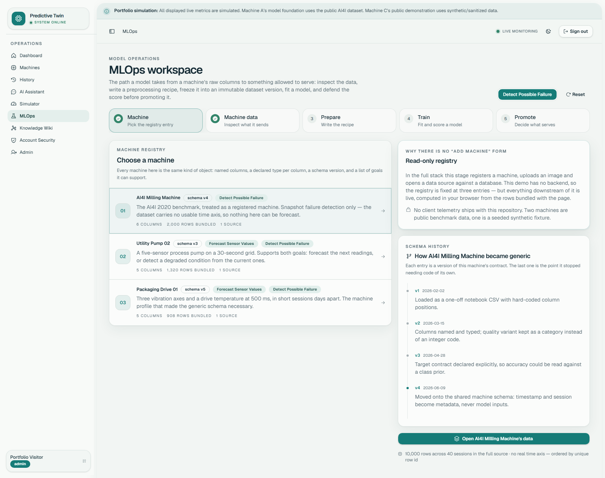

<strong>The history is part of the machine.</strong> Each registry entry carries the versions of its own contract, ending at the point where it stopped needing code of its own.

### Five stages you can open

The public demo ships the workflow as a frontend-only workspace at **`/mlops`**, over three public or synthetic machines. Nothing here is scripted: the recipe genuinely recomputes and the models genuinely fit, in your browser, on every click.

| Stage | What happens |
|---|---|
| **Machine** | The registry, and each machine's **schema history** as a timeline — five versions for the drive, because a schema version with no record of what changed is a number rather than a history. |
| **Data** | The column contract, the connected sources, and per-goal readiness gates. A machine with no time axis is told it cannot forecast instead of being offered the button. |
| **Prepare** | Split, missing values, scaling, session-aware resampling, and a **calculated-feature editor** with a real formula compiler. Freezing the recipe produces an immutable dataset version with a digest. |
| **Train** | Architectures split into *trains here* and *production worker only*, a hyperparameter form that refuses impossible configurations, and the exact JSON the run will carry. |
| **Promote** | Candidates scored against the trivial answer, a quality verdict, and a **required written reason** to override a blocked promotion. |

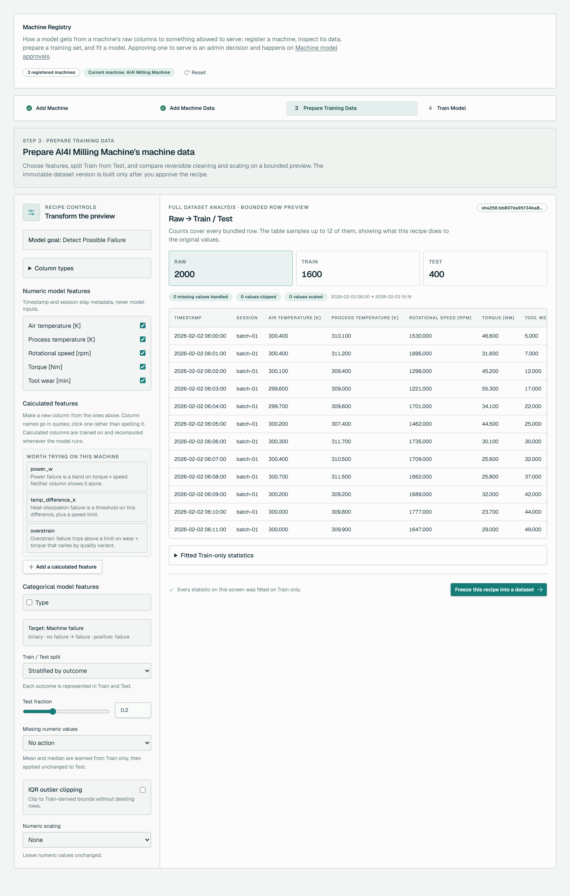

<strong>The recipe is the artifact.</strong> Split, missing values, scaling and calculated columns on the left; what they do to the actual rows on the right, with every statistic fitted on Train only.

### The calculated-feature moment

The AI4I failure rules are written on *combinations* of columns — power is `torque × speed`, heat dissipation is a temperature *difference*, overstrain is `wear × torque`. A model given only the six raw columns has to rediscover each product from a handful of positive rows.

Spelling them out in the formula editor, same forest, same hyperparameters, same split:

| | Raw columns | With `power_w`, `temp_difference_k`, `overstrain` |
|---|---:|---:|
| Balanced accuracy | 83.7% | **93.1%** |
| Recall on failures | 69.6% | **87.0%** |
| Plain accuracy | 96.3% | 98.5% |

The class prior on that split is 94.3%, which is the number both accuracies have to be read against — and it is why the middle row matters more than the bottom one. Those are the workspace's own default settings, so the screenshot below is a run anyone can reproduce by clicking. A unit test pins the gap in place, so the argument for having a formula editor at all cannot quietly stop being true.

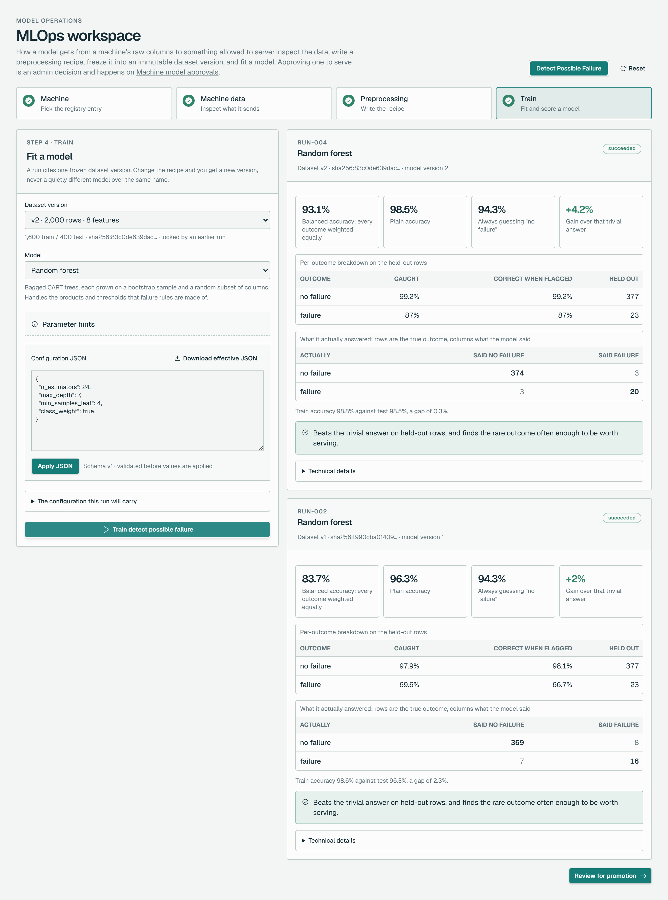

<strong>Two runs, one screen:</strong> the newer run cites dataset v2 and finds 87% of the failures; the older one, same model on the raw columns, finds 69.6%. Both are scored against the same 94.3% trivial answer.

### Honesty is the feature

- **Every run reports the majority-class baseline.** An accuracy figure with nothing to compare it to is decoration.
- **The gate distinguishes a bad model from a deliberate trade.** A class-balanced model that finds rare failures usually *loses* plain accuracy to the class prior. That is called `borderline` and explained, not `not_recommended`.
- **A recipe that drops the informative columns really does produce a model that loses to the baseline**, and the gate really does block it. Nothing about that path is mocked.
- **Architectures the browser cannot fit refuse to run.** LSTM, GRU, TCN and XGBoost are described and then decline, saying they train on the production worker. An invented score would have been easier and worthless.

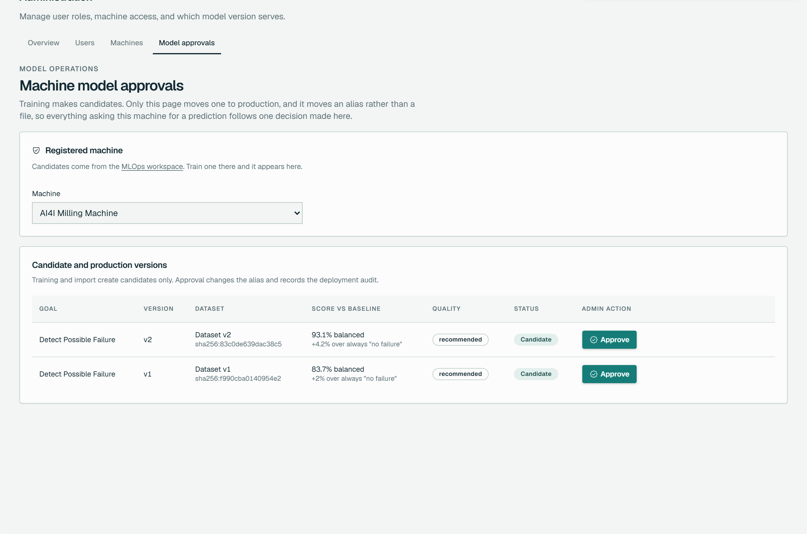

<strong>Promotion moves an alias, not a file.</strong> Every candidate is shown against the trivial answer with a verdict attached, and nothing serves until someone chooses — so a caller gets an honest error rather than a silently stale model.

<sub>↑ [Map](#start-anywhere) · → **Next:** [A prediction you can challenge](#a-prediction-is-more-useful-when-you-can-challenge-it) · ↔ **Related:** [Memory the agent can read](#memory-the-agent-can-read-and-so-can-you) · [Under the hood](#under-the-hood)</sub>

---

## A prediction is more useful when you can challenge it

A probability alone does not tell an operator what to do next. So the models became a digital twin: a place to compare current conditions with a simulated intervention.

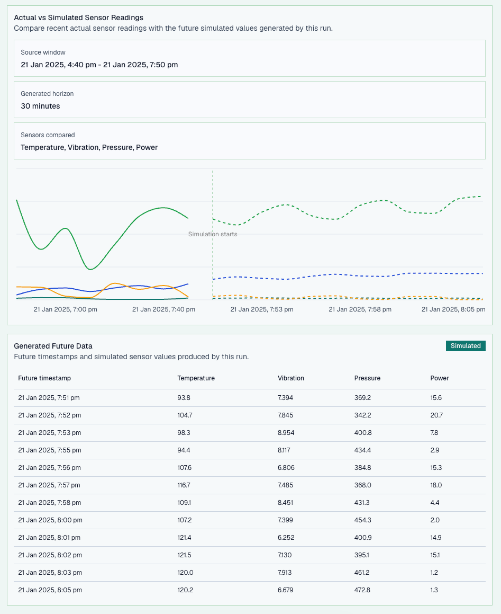

The simulator keeps the two timelines visible:

1. Select a real or fixture-backed source window.
2. Change the operating scenario.
3. Generate a future sensor horizon.
4. Compare baseline risk with projected risk.
5. Turn the result into a maintenance recommendation.

That changed the product question from **“Will it fail?”** to **“What can we do now, and what might that change?”**

<sub>↑ [Map](#start-anywhere) · → **Next:** [The dashboard needed a brain](#the-dashboard-needed-a-brain) · ↔ **Related:** [Then make the signal predictive](#then-make-the-signal-predictive)</sub>

---

## The dashboard needed a brain

The first chatbot used a fixed router. Every new intent made it more brittle, so we replaced it with a **supervisor agent** that can choose tools and delegate work.

The supervisor does more than answer questions. It can:

- run failure predictions and what-if simulations
- extract useful signals from operator complaints
- create maintenance proposals
- delegate database questions to a read-only SQL sub-agent
- read machine and maintenance knowledge from a Karpathy-style LLM wiki stored in an Obsidian vault
- keep working memory across conversation turns

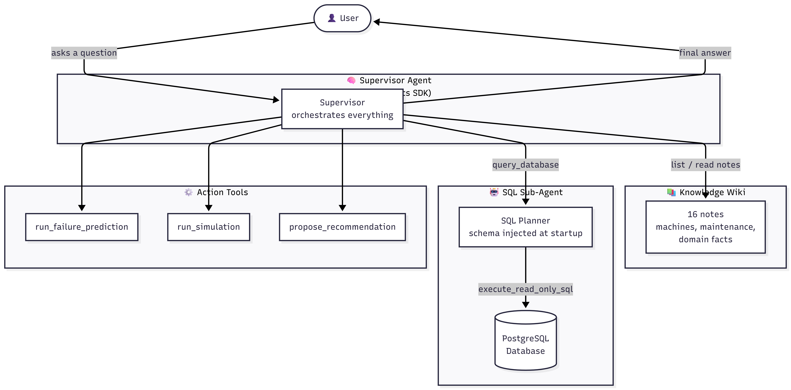

### From a complaint to an investigation

An operator can ask, **“Why was this machine so noisy yesterday?”** The supervisor turns that informal complaint into an investigation:

1. Read the machine capabilities and maintenance guidance from the Obsidian LLM wiki.
2. Identify noise as a possible vibration signal.
3. Delegate a read-only historical telemetry query to the SQL sub-agent.
4. Pass the retrieved row or time window to the prediction tool.
5. Combine the evidence into a clear explanation and useful next action.

This lets the agent interact with each machine through the same tools used by the application, instead of generating an answer from the prompt alone.

<table>
  <tr>
    <td width="50%">
      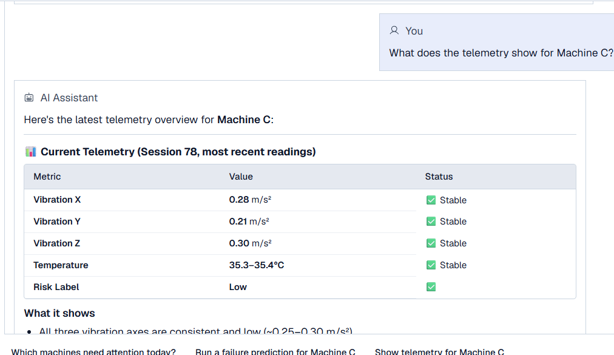
      <br />
      <strong>Ask in plain English.</strong> The supervisor retrieves evidence and turns it into an operational summary.
    </td>
    <td width="50%">
      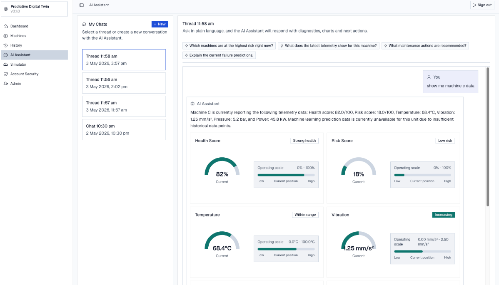
      <br />
      <strong>Return more than text.</strong> Responses can surface machine health, risk, temperature, and vibration as UI components.
    </td>
  </tr>
</table>

<table>
  <tr>
    <td width="50%">
      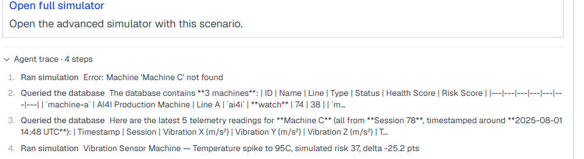
      <br />
      <strong>Show the actions.</strong> The trace shows which tool the supervisor selected, what it delegated to the SQL sub-agent, and how the result reached the final response.
    </td>
    <td width="50%">
      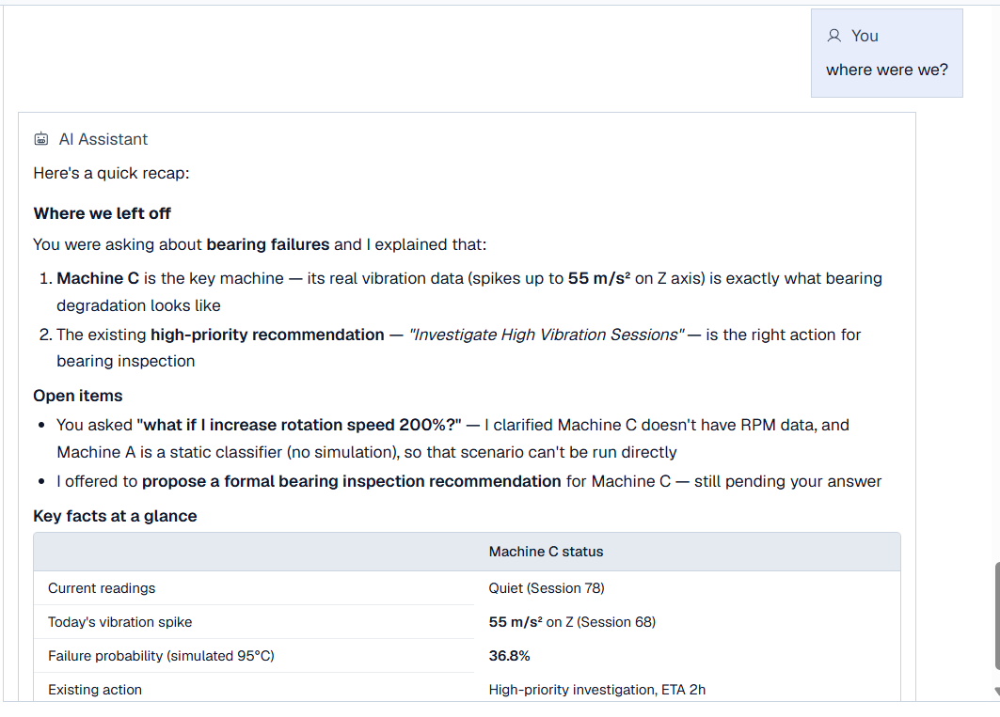
      <br />
      <strong>Keep the thread.</strong> Working memory lets the assistant recap prior reasoning and unresolved actions.
    </td>
  </tr>
</table>

The team observed roughly a **75% improvement in typical response time** after the redesign. That is an internal estimate, not a controlled benchmark. It matched the architectural improvement we could see: less rigid routing, fewer unnecessary hops, and tools selected at runtime.

> [!NOTE]
> The trace shows tool calls, delegations, and results at a high level. It does not expose hidden chain-of-thought. In the frontend-only demo these actions are scripted examples of the response contract. Full-stack mode connects the same workflow to FastAPI, PostgreSQL, model services, and the Obsidian knowledge vault.

<sub>↑ [Map](#start-anywhere) · → **Next:** [Memory the agent can read](#memory-the-agent-can-read-and-so-can-you) · ↔ **Related:** [Under the hood](#under-the-hood)</sub>

---

## Memory the agent can read, and so can you

The [supervisor](#the-dashboard-needed-a-brain) already reads from a maintenance wiki. This chapter is about why that knowledge is a **wiki** and not a vector index.

The design was inspired by **["Retrieval as Reasoning: Self-Evolving Agent-Native Retrieval via LLM-Wiki"](https://arxiv.org/abs/2605.25480)**, which argues for retrieval an agent *navigates* rather than merely queries, and reports promising gains on multi-hop and cross-document reasoning. The paper inspired the design here; this project has not reproduced its benchmarks and does not inherit its results.

The idea in one breath: **BM25 for fast retrieval, a persistent interconnected wiki for structured knowledge, relationships the agent can follow when one lookup is not enough, and knowledge that stays human-readable and human-editable instead of an opaque vector store.**

Chunk-and-embed is very good at *"find me a passage that sounds like this"* and weak at *"what caused this, what detected it, and what did we decide last time?"* — where the answer is spread across four pages and lives in the links between them. So the corpus is plain markdown with YAML frontmatter and `[[wikilinks]]`, and a few decisions follow from that:

- **Nothing is stored as a graph.** Nodes are pages, edges are links written inside the pages, so the graph and the search index are both derived from the text on read. Edit a page in the pane and the graph changes shape in the same frame — because the text *is* the graph.
- **Relationships are typed.** `sources`, `caused_by`, `detected_by`, `mitigated_by`. Invent a new relation in a page's frontmatter and the graph draws it, with no code change anywhere.
- **A link to a page nobody has written becomes a *wanted page*** — dashed and hollow in the graph rather than a dropped edge. That is the worklist, not an error state.
- **Numeric claims need a source.** A number in a `domain/` or `concepts/` page either cites a source page or is flagged as unsourced, and the lint panel counts them.
- **Disagreements are kept, not resolved.** Where a checked-in original contradicts the standards, a `Conflict` callout says so and both stay. The seeded vault carries seven.
- **Provenance is a view of its own**, and the `raw/` originals are immutable — so the claim that a legacy guideline's vibration table is four times too permissive can be *checked* rather than taken on trust.

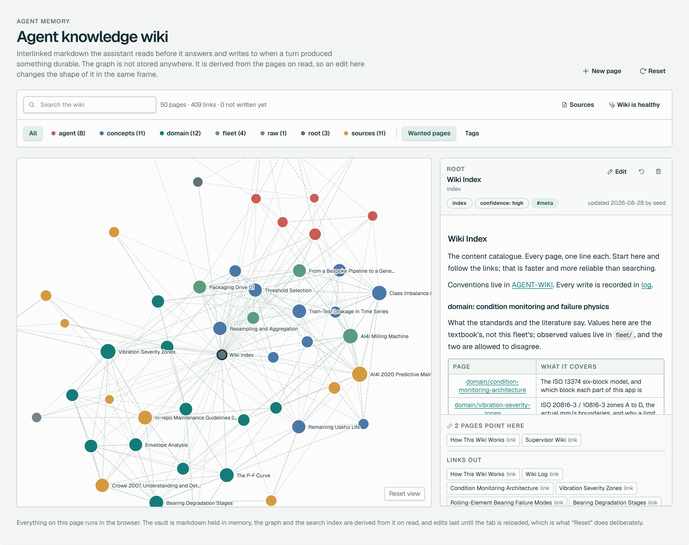

<strong>50 pages, 409 links, nothing written yet that nobody asked for.</strong> Colour is the namespace, size is how many pages point here, and the header counts are computed from the markdown rather than stored beside it.

<table>
  <tr>
    <td width="50%">
      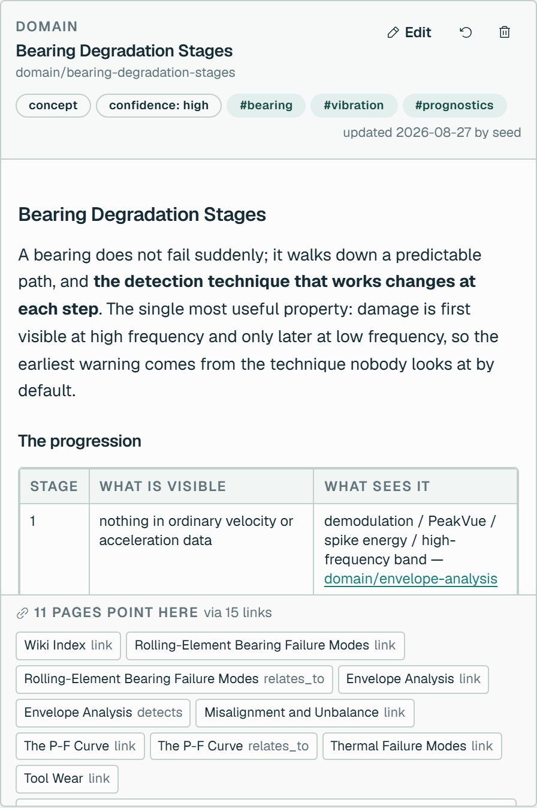
      <br />
      <strong>Search, then follow the links.</strong> BM25 ranks the matches, the graph dims everything else, and the page itself cites its sources as links you can walk.
    </td>
    <td width="50%">
      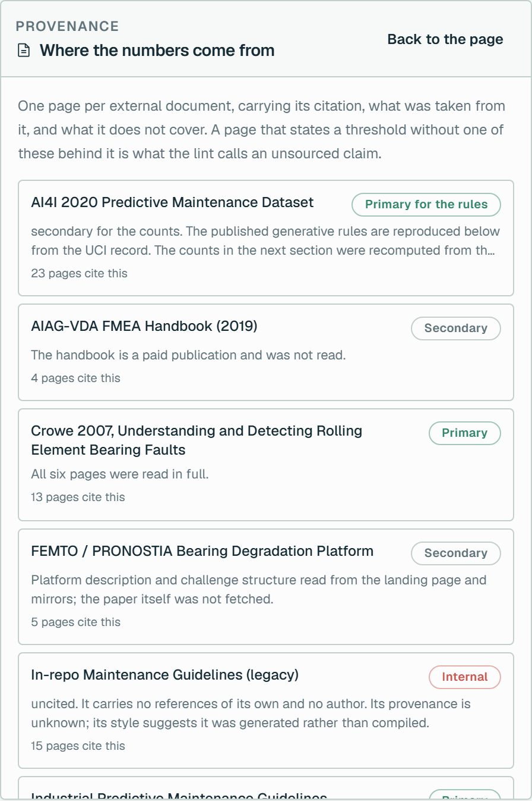
      <br />
      <strong>Where the numbers come from.</strong> One page per external document, marked primary, secondary, paywalled or internal, with a count of what depends on it.
    </td>
  </tr>
</table>

Because the assistant writes through this pane, two rules live in the store rather than in the UI: `raw/` cannot be edited at all, and `agent/` — the assistant's own operating instructions — is not editable from the pane the assistant writes through. Every save requires a written reason, which lands in an append-only log, because it is the only thing a future reader gets.

The demo's vault at **`/knowledge`** carries 50 interlinked pages: ISO vibration severity zones, bearing degradation physics, envelope analysis, class imbalance and threshold selection, provenance for each public dataset, and the fleet's own registry entries. It is public-domain knowledge and this project's own decisions — the client machine's page is not here, and a test enforces that no page mentions it or any client sensor.

<sub>↑ [Map](#start-anywhere) · → **Next:** [Close the loop](#close-the-loop-with-live-ingestion) · ↔ **Related:** [What this leans on](#what-this-leans-on) · [A trained model is not yet a workflow](#a-trained-model-is-not-yet-a-workflow)</sub>

---

## Close the loop with live ingestion

The final step is the bridge back to the physical machines. We prototyped configurable MQTT subscriptions so telemetry sources can be mapped without hard-coding one broker or one machine.

<table>
  <tr>
    <td width="42%">
      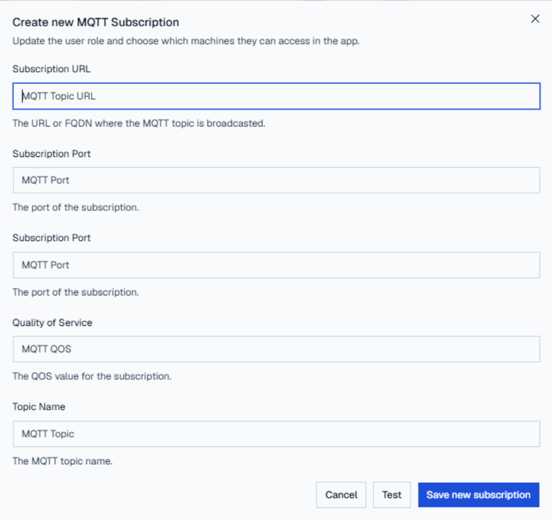
      <br />
      <strong>Configure the source:</strong> endpoint, port, QoS, and topic.
    </td>
    <td width="58%">
      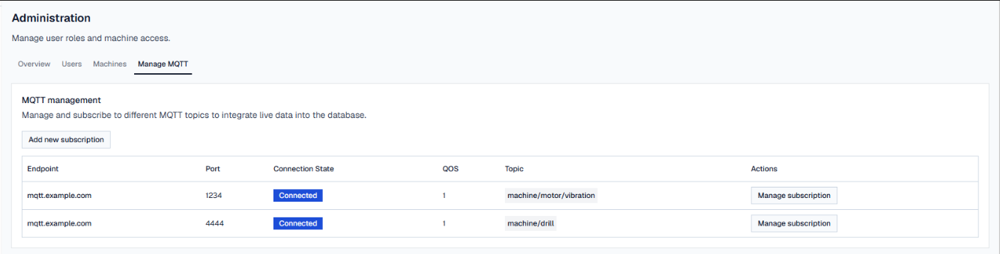
      <br />
      <strong>Manage the mapping:</strong> see connection state and assign topics to machine streams.
    </td>
  </tr>
</table>

This is a prototype for future ingestion, not a claim that the public Vercel demo is connected to live industrial equipment.

<sub>↑ [Map](#start-anywhere) · → **Next:** [The demo, in pictures](#the-demo-in-pictures) · ↔ **Related:** [Under the hood](#under-the-hood)</sub>

---

## The demo, in pictures

Every screen here appears somewhere above. This is the index if you would rather jump straight to one.

| Screen | Explained in |
|---|---|
| [Machine registry and schema history](assets/mlops_machine_registry.png) | [Machine C was never generic](#machine-c-was-never-generic) |
| [Preprocessing recipe with calculated features](assets/mlops_prepare_recipe.png) | [Five stages you can open](#five-stages-you-can-open) |
| [Two runs on one scorecard](assets/mlops_model_scorecard.png) | [The calculated-feature moment](#the-calculated-feature-moment) |
| [The promotion gate](assets/mlops_promotion_gate.png) | [Honesty is the feature](#honesty-is-the-feature) |
| [The knowledge graph](assets/knowledge_wiki_graph.png) | [Memory the agent can read](#memory-the-agent-can-read-and-so-can-you) |
| [A searched-and-opened wiki page](assets/knowledge_wiki_page.png) | [Memory the agent can read](#memory-the-agent-can-read-and-so-can-you) |
| [The provenance panel](assets/knowledge_wiki_provenance.png) | [Memory the agent can read](#memory-the-agent-can-read-and-so-can-you) |
| [Digital-twin simulation](assets/similation_pane_with_mockdata.png) | [A prediction you can challenge](#a-prediction-is-more-useful-when-you-can-challenge-it) |
| [Agent traces and telemetry retrieval](assets/chatbot_tracing.png) | [From a complaint to an investigation](#from-a-complaint-to-an-investigation) |
| [MQTT subscription prototype](assets/MQTT_subscription_2.png) | [Close the loop](#close-the-loop-with-live-ingestion) |

---

## Under the hood

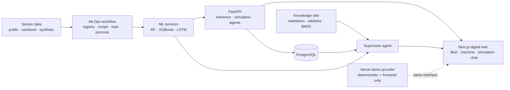
```mermaid
flowchart LR
    Sensors["Sensor data<br/>public · sanitized · synthetic"] --> MLOps["MLOps workflow<br/>registry · recipe · train · promote"]
    MLOps --> Models["ML services<br/>RF · XGBoost · LSTM"]
    Models --> API["FastAPI<br/>inference · simulation · agents"]
    API --> DB[(PostgreSQL)]
    API --> UI["Next.js digital twin<br/>fleet · machine · simulation · chat"]
    Wiki["Knowledge wiki<br/>markdown · wikilinks · BM25"] --> Agent["Supervisor agent"]
    DB --> Agent
    Models --> Agent
    Agent --> UI
    Demo["Vercel demo provider<br/>deterministic + frontend-only"] -. same interface .-> UI
```

The `DigitalTwinDataProvider` is the seam between deployment modes:

- `NEXT_PUBLIC_DEMO_MODE=true` → deterministic frontend-only portfolio experience
- unset or `false` → FastAPI provider with the local Docker stack

### Stack

| Layer | Technology |
|---|---|
| Frontend | Next.js 16 · React 19 · TypeScript · Tailwind CSS · Recharts |
| Backend | FastAPI · SQLAlchemy · Pydantic · PostgreSQL |
| ML | PyTorch LSTM · XGBoost · Random Forest · scikit-learn · pandas · NumPy |
| Agent system | Supervisor · six domain tools · read-only SQL sub-agent · working memory · knowledge wiki · persisted traces |
| MLOps workspace | Registry schema versions · frozen recipes with content digests · in-browser logistic regression, CART forest, gradient boosting, MLP and ridge-lag forecaster · quality gates |
| Knowledge wiki | Markdown + YAML frontmatter corpus · `[[wikilinks]]` · BM25 retrieval · d3-force graph · lint and provenance |
| Quality | Vitest · Playwright · linting · production build checks |

<details>
<summary><strong>What gets persisted?</strong></summary>

Machines, telemetry profiles, predictions, recommendations, history, simulations, user access, sessions, chat memory, MFA state, and agent traces are represented in the PostgreSQL/SQLAlchemy model. The source of truth is [`apps/backend/app/db/models.py`](apps/backend/app/db/models.py).

</details>

<details>
<summary><strong>What can I explore in the interface?</strong></summary>

- Fleet health, risk, uptime, weekly events, and machine telemetry
- Random Forest classification and autoregressive LSTM forecasting flows
- Baseline-versus-intervention simulations
- A five-stage MLOps workspace that really prepares data and really trains models in the browser
- An agent knowledge wiki: graph, BM25 search, editable pages, backlinks, provenance and lint
- AI-assisted investigation with visible tool traces
- Roles, per-machine access, history, and account security
- Frontend-only demo mode or the full FastAPI/PostgreSQL stack

</details>

<sub>↑ [Map](#start-anywhere) · → **Next:** [Run it yourself](#run-it-yourself) · ↔ **Related:** [The demo, in pictures](#the-demo-in-pictures)</sub>

---

## Run it yourself

### Fastest path: frontend demo mode

```bash
cd apps/frontend
npm ci
cp .env.example .env.local
# Set NEXT_PUBLIC_DEMO_MODE=true
npm run dev
```

Open `http://localhost:3000`.

### Full stack

```bash
cp apps/backend/.env.example apps/backend/.env
docker compose up --build
```

FastAPI documentation is available at `http://localhost:8000/docs`. The seeded local account is `admin` / `admin`; the hosted Vercel demo needs no credentials.

### Verify it

```bash
cd apps/frontend
npm run test:unit
npm run lint
npm run build
npm run test:e2e
```

### Deploy the portfolio mode

Import the repository into Vercel and set the root directory to `apps/frontend`. The included `vercel.json` enables demo mode without external services or secrets.

<sub>↑ [Map](#start-anywhere) · → **Next:** [What this leans on](#what-this-leans-on) · ↔ **Related:** [Memory the agent can read](#memory-the-agent-can-read-and-so-can-you)</sub>

---

## What this leans on

Very little here was invented from nothing, and the parts that came from somewhere say so — in the wiki's provenance panel as well as here.

| Source | What it gave the project |
|---|---|
| [AI4I 2020 Predictive Maintenance Dataset](https://archive.ics.uci.edu/dataset/601/ai4i+2020+predictive+maintenance+dataset) | The public classification baseline, and the five published failure rules the [MLOps demo](#a-trained-model-is-not-yet-a-workflow) regenerates its rows from |
| ISO 10816-3 / 20816-3 and ISO 13374-1 | Vibration severity zones and the condition-monitoring block model the wiki's `domain/` pages are written against |
| Rolling-element bearing fault literature — envelope analysis, the P-F curve | The physics the assistant reasons with, cited page by page rather than in bulk |
| Time-series generative modelling (TSGM) | The [synthetic continuation](#the-synthetic-data-decision) used to expand the Machine C development set |
| ["Retrieval as Reasoning: Self-Evolving Agent-Native Retrieval via LLM-Wiki"](https://arxiv.org/abs/2605.25480) | Inspired the design of the [knowledge wiki](#memory-the-agent-can-read-and-so-can-you): retrieval an agent navigates rather than only queries. The paper reports promising multi-hop and cross-document gains; this project has not reproduced them and does not claim them. |
| Working as an ML engineer intern | The reason there is a frozen recipe and a [promotion gate](#honesty-is-the-feature) at all, rather than a notebook and a number |

<sub>↑ [Map](#start-anywhere) · → **Next:** [Scope, credit and provenance](#scope-credit-and-provenance)</sub>

---

## Scope, credit, and provenance

This is a sanitized portfolio repository from Swinburne University **COS40005 Computing Technology Project A/B**, built by a six-person team.

My focus was the **ML/AI engineering layer**: analysing the original routing limitations, migrating the assistant to a native tool-calling supervisor, implementing the read-only SQL sub-agent, building the knowledge wiki and connecting it to the agent, surfacing agent traces, adding session-level working memory, and moving the bespoke Machine C pipeline onto a generic machine schema with a visible preparation, training and promotion workflow.

The full team and individual contributions are documented in [CONTRIBUTORS.md](CONTRIBUTORS.md).

<sub>↑ [Back to the map](#start-anywhere)</sub>

Private client readings, credentials, internal documents, and proprietary material are intentionally excluded. The hosted application uses ten fictional fleet instances derived from three model profiles; these are demo assets, not ten independently trained models.

<div align="center">

### Data told us what happened. Models suggested what happens next. The agent made it actionable.

[](https://predictive-maintenance-digital-twin.vercel.app/dashboard)

</div>
